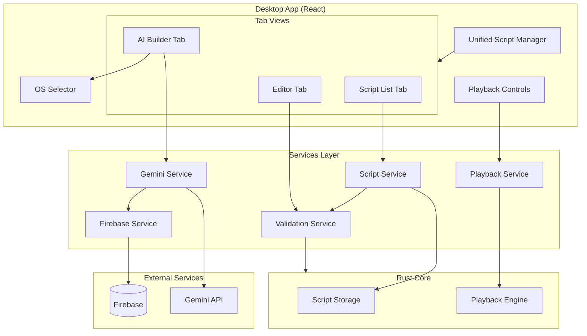

# Design Document: AI Script Builder

## Overview

AI Script Builder là một tính năng cho phép người dùng tạo automation test scripts thông qua giao diện chat với AI. Hệ thống sử dụng Gemini API để hiểu yêu cầu ngôn ngữ tự nhiên và sinh ra các script tương thích với rust-core format.

### Key Features
- Chat interface để mô tả test scenarios
- Tích hợp Gemini API để sinh script
- Quản lý API key qua Firebase
- Preview và edit script trước khi lưu
- Validation đảm bảo tương thích với rust-core

### Extended Features (v2)
- Save script và test playback trực tiếp từ AI Builder
- Target OS selector (macOS, Windows, Universal)
- Tích hợp AI scripts vào Desktop Recorder script selector
- Unified interface gộp Script Editor và AI Script Builder

## Architecture



## Components and Interfaces

### 1. Chat Interface Component

```typescript
// ChatMessage type
interface ChatMessage {
  id: string;
  role: 'user' | 'assistant' | 'system';
  content: string;
  timestamp: Date;
  scriptPreview?: ScriptData;
}

// ChatInterfaceProps
interface ChatInterfaceProps {
  onScriptGenerated: (script: ScriptData) => void;
  apiKeyConfigured: boolean;
}

// ChatInterfaceState
interface ChatInterfaceState {
  messages: ChatMessage[];
  inputValue: string;
  isLoading: boolean;
  error: string | null;
}
```

### 2. Gemini Service

```typescript
interface GeminiService {
  // Initialize with API key
  initialize(apiKey: string): Promise<void>;
  
  // Generate script from user prompt
  generateScript(
    prompt: string,
    context: ConversationContext
  ): Promise<GenerationResult>;
  
  // Refine existing script based on feedback
  refineScript(
    currentScript: ScriptData,
    feedback: string
  ): Promise<GenerationResult>;
}

interface ConversationContext {
  previousMessages: ChatMessage[];
  currentScript?: ScriptData;
  availableActions: ActionType[];
}

interface GenerationResult {
  success: boolean;
  script?: ScriptData;
  message: string;
  needsClarification?: boolean;
  clarificationQuestions?: string[];
}
```

### 3. Firebase API Key Service

```typescript
interface ApiKeyService {
  // Store encrypted API key
  storeApiKey(userId: string, apiKey: string): Promise<void>;
  
  // Retrieve and decrypt API key
  getApiKey(userId: string): Promise<string | null>;
  
  // Check if API key exists
  hasApiKey(userId: string): Promise<boolean>;
  
  // Delete API key
  deleteApiKey(userId: string): Promise<void>;
}
```

### 4. Script Validation Service

```typescript
interface ScriptValidationService {
  // Validate entire script
  validateScript(script: ScriptData): ValidationResult;
  
  // Validate single action
  validateAction(action: Action): ValidationResult;
  
  // Check rust-core compatibility
  checkCompatibility(script: ScriptData): CompatibilityResult;
}

interface ValidationResult {
  valid: boolean;
  errors: ValidationError[];
  warnings: ValidationWarning[];
}

interface ValidationError {
  field: string;
  message: string;
  actionIndex?: number;
}
```

### 5. Script Preview Component

```typescript
interface ScriptPreviewProps {
  script: ScriptData | null;
  onEdit: (script: ScriptData) => void;
  onSave: (script: ScriptData) => void;
  onDiscard: () => void;
  onPlay: (script: ScriptData) => void;
  validationResult: ValidationResult;
  isSaved: boolean;
  isPlaying: boolean;
  playbackProgress?: PlaybackProgress;
}

interface PlaybackProgress {
  currentAction: number;
  totalActions: number;
  status: 'playing' | 'paused' | 'completed' | 'error';
  error?: string;
}
```

### 6. OS Selector Component

```typescript
type TargetOS = 'macos' | 'windows' | 'universal';

interface OSSelectorProps {
  selectedOS: TargetOS;
  onOSChange: (os: TargetOS) => void;
  disabled?: boolean;
}

// OS-specific key mappings
const OS_KEY_MAPPINGS: Record<TargetOS, Record<string, string>> = {
  macos: {
    copy: 'Cmd+C',
    paste: 'Cmd+V',
    cut: 'Cmd+X',
    selectAll: 'Cmd+A',
    save: 'Cmd+S',
    undo: 'Cmd+Z',
    redo: 'Cmd+Shift+Z',
  },
  windows: {
    copy: 'Ctrl+C',
    paste: 'Ctrl+V',
    cut: 'Ctrl+X',
    selectAll: 'Ctrl+A',
    save: 'Ctrl+S',
    undo: 'Ctrl+Z',
    redo: 'Ctrl+Y',
  },
  universal: {
    // Use generic descriptions, let playback engine handle
    copy: 'Copy',
    paste: 'Paste',
    cut: 'Cut',
    selectAll: 'SelectAll',
    save: 'Save',
    undo: 'Undo',
    redo: 'Redo',
  },
};
```

### 7. Unified Script Manager Component

```typescript
type TabType = 'list' | 'builder' | 'editor';

interface UnifiedScriptManagerProps {
  initialTab?: TabType;
  initialScriptPath?: string;
}

interface UnifiedScriptManagerState {
  activeTab: TabType;
  scripts: ScriptInfo[];
  selectedScript: ScriptData | null;
  selectedScriptPath: string | null;
  filter: ScriptFilter;
  isLoading: boolean;
  error: string | null;
}

interface ScriptFilter {
  source: 'all' | 'recorded' | 'ai_generated';
  targetOS?: TargetOS;
  searchQuery?: string;
}

interface ScriptInfo {
  path: string;
  filename: string;
  createdAt: string;
  duration: number;
  actionCount: number;
  source: 'recorded' | 'ai_generated';
  targetOS?: TargetOS;
}
```

### 8. Playback Service

```typescript
interface PlaybackService {
  // Start playback of a script
  startPlayback(
    scriptPath: string,
    options?: PlaybackOptions
  ): Promise<void>;
  
  // Stop current playback
  stopPlayback(): Promise<void>;
  
  // Pause/resume playback
  togglePause(): Promise<boolean>;
  
  // Get current playback status
  getStatus(): PlaybackStatus;
  
  // Subscribe to playback events
  onProgress(callback: (progress: PlaybackProgress) => void): () => void;
  onComplete(callback: () => void): () => void;
  onError(callback: (error: string) => void): () => void;
}

interface PlaybackOptions {
  speed?: number;
  loopCount?: number;
}

interface PlaybackStatus {
  isPlaying: boolean;
  isPaused: boolean;
  currentScript?: string;
  progress?: PlaybackProgress;
}
```

### 9. Custom Model Management

```typescript
/**
 * Custom model configuration for user-defined AI models
 */
interface CustomModelConfig {
  id: string;                    // Unique identifier (auto-generated)
  name: string;                  // Display name
  modelId: string;               // Model ID to send to API (e.g., "gpt-4", "claude-3")
  apiBaseUrl: string;            // API endpoint URL
  apiKey: string;                // Encrypted API key
  description?: string;          // Optional description
  createdAt: string;             // ISO 8601 timestamp
  updatedAt: string;             // ISO 8601 timestamp
  isCustom: true;                // Flag to identify custom models
}

/**
 * Form data for adding/editing custom models
 */
interface CustomModelFormData {
  name: string;
  modelId: string;
  apiBaseUrl: string;
  apiKey: string;
  description?: string;
}

/**
 * Validation result for custom model API
 */
interface CustomModelValidationResult {
  valid: boolean;
  error?: string;
  responseTime?: number;
}

/**
 * Custom Model Service interface
 */
interface CustomModelService {
  // Add a new custom model
  addCustomModel(config: CustomModelFormData): Promise<CustomModelConfig>;
  
  // Update existing custom model
  updateCustomModel(id: string, config: Partial<CustomModelFormData>): Promise<CustomModelConfig>;
  
  // Delete custom model
  deleteCustomModel(id: string): Promise<void>;
  
  // Get all custom models
  getCustomModels(): Promise<CustomModelConfig[]>;
  
  // Get single custom model by ID
  getCustomModel(id: string): Promise<CustomModelConfig | null>;
  
  // Validate custom model API connection
  validateCustomModel(config: CustomModelFormData): Promise<CustomModelValidationResult>;
}
```

### 10. Custom Model Dialog Component

```typescript
interface CustomModelDialogProps {
  isOpen: boolean;
  onClose: () => void;
  onSave: (config: CustomModelFormData) => Promise<void>;
  editingModel?: CustomModelConfig;  // If provided, dialog is in edit mode
  isValidating?: boolean;
  validationError?: string;
}

interface CustomModelDialogState {
  formData: CustomModelFormData;
  errors: Record<string, string>;
  isValidating: boolean;
  validationResult?: CustomModelValidationResult;
}
```

## Data Models

### Script Data (rust-core compatible)

```typescript
interface ScriptData {
  version: string;
  metadata: ScriptMetadata;
  actions: Action[];
}

interface ScriptMetadata {
  created_at: string; // ISO 8601
  duration: number;
  action_count: number;
  core_type: string;
  platform: string;
  screen_resolution?: [number, number];
  source: 'recorded' | 'ai_generated';
  target_os?: TargetOS;
  script_name?: string;
  generated_at?: string;
  additional_data?: Record<string, unknown>;
}

interface Action {
  type: ActionType;
  timestamp: number;
  x?: number;
  y?: number;
  button?: 'left' | 'right' | 'middle';
  key?: string;
  text?: string;
  modifiers?: string[];
  additional_data?: Record<string, unknown>;
}

type ActionType = 
  | 'mouse_move'
  | 'mouse_click'
  | 'mouse_double_click'
  | 'mouse_drag'
  | 'mouse_scroll'
  | 'key_press'
  | 'key_release'
  | 'key_type'
  | 'screenshot'
  | 'wait'
  | 'custom';
```

### Gemini Prompt Template

```typescript
interface PromptTemplate {
  systemPrompt: string;
  actionSchema: string;
  exampleScripts: ScriptData[];
  userContext: string;
}

const SYSTEM_PROMPT = `
You are an automation script generator. Generate scripts in JSON format compatible with the following schema:

Available Action Types:
- mouse_move: Move mouse to coordinates (requires x, y)
- mouse_click: Click at coordinates (requires x, y, button)
- key_press: Press a key (requires key)
- key_type: Type text (requires text)
- wait: Wait for duration (requires timestamp delta)

Output Format:
{
  "version": "1.0",
  "metadata": { ... },
  "actions": [ ... ]
}

Rules:
1. All timestamps must be in seconds, increasing order
2. Mouse coordinates must be positive integers
3. Key names must be valid key identifiers
4. Include appropriate wait times between actions
`;
```

### Firebase API Key Storage

```typescript
interface StoredApiKey {
  userId: string;
  encryptedKey: string;
  createdAt: Date;
  updatedAt: Date;
}
```

## Correctness Properties

*A property is a characteristic or behavior that should hold true across all valid executions of a system-essentially, a formal statement about what the system should do. Properties serve as the bridge between human-readable specifications and machine-verifiable correctness guarantees.*

### Property 1: API Key Storage Round-Trip

*For any* valid Gemini API key and user ID, storing the key and then retrieving it should return the original key value.

**Validates: Requirements 1.1, 1.2, 1.4**

### Property 2: Message History Consistency

*For any* sequence of chat messages (user or AI), all messages should appear in the chat history in chronological order, and the total count should equal the number of messages sent plus received.

**Validates: Requirements 2.2, 2.4, 2.5**

### Property 3: Prompt Context Inclusion

*For any* user request sent to Gemini API, the prompt should contain the complete list of available action types and their required parameters.

**Validates: Requirements 3.1**

### Property 4: Script Parsing Validity

*For any* valid JSON script string returned by Gemini, parsing it should produce a ScriptData object with all required fields populated.

**Validates: Requirements 3.2**

### Property 5: Generated Script Validity

*For any* script generated by the AI, the script should pass validation against the rust-core schema, including: valid action types, valid coordinates for mouse actions, valid key codes for keyboard actions, and timestamps in ascending order.

**Validates: Requirements 3.3, 6.1, 6.2, 6.3, 6.4**

### Property 6: Script Modification Validation

*For any* user modification to a script action, the validation service should immediately check the modification and return a validation result.

**Validates: Requirements 4.2**

### Property 7: Script Serialization Round-Trip

*For any* valid ScriptData object, serializing to JSON and deserializing back should produce an equivalent ScriptData object.

**Validates: Requirements 4.3, 6.5**

### Property 8: Suggestion Relevance

*For any* user input text containing action keywords (click, type, wait, etc.), the suggestion system should return suggestions containing at least one matching action type.

**Validates: Requirements 5.2**

### Property 9: Example Prompt Population

*For any* example prompt selected by the user, the input field should contain exactly the text of the selected example.

**Validates: Requirements 5.4**

### Property 10: Script Preview Completeness

*For any* valid generated script, the preview should display all actions with their type, parameters, and human-readable descriptions.

**Validates: Requirements 3.5, 4.4**

### Property 11: Save and Play Button State

*For any* valid generated script, the Save button should be visible. After successful save, the Play button should become visible.

**Validates: Requirements 7.1, 7.4**

### Property 12: AI Script Metadata Consistency

*For any* saved AI-generated script, the metadata should contain: source='ai_generated', generated_at timestamp, script_name, and target_os.

**Validates: Requirements 7.3, 8.6**

### Property 13: OS-Specific Key Code Validation

*For any* generated script with a target OS, all keyboard actions should use key codes valid for that OS. Universal scripts should only contain cross-platform compatible actions.

**Validates: Requirements 8.3, 8.4, 8.5**

### Property 14: OS Context in Prompt

*For any* selected target OS, the AI prompt should include OS-specific context and key mappings.

**Validates: Requirements 8.2**

### Property 15: Script List Completeness

*For any* combination of recorded and AI-generated scripts in storage, the script list should display all scripts with correct source type indicators.

**Validates: Requirements 9.1, 9.2, 10.2**

### Property 16: Script Filter Correctness

*For any* filter selection (recorded, AI-generated, all), the filtered list should contain only scripts matching the filter criteria.

**Validates: Requirements 9.4**

### Property 17: AI Script Playback Compatibility

*For any* AI-generated script, selecting it in the Recorder should load it with the same playback controls as recorded scripts.

**Validates: Requirements 9.3**

### Property 18: Unified Editor Consistency

*For any* script (recorded or AI-generated), opening it in the Editor tab should provide the same editing tools and capabilities.

**Validates: Requirements 10.3, 10.6**

### Property 19: Tab Navigation Workflow

*For any* generated AI script, the user should be able to transition from AI Builder tab to Editor tab with the script loaded for refinement.

**Validates: Requirements 10.5**

### Property 20: Custom Model Storage Round-Trip

*For any* valid custom model configuration, saving the model and then retrieving it should return an equivalent configuration with all fields preserved.

**Validates: Requirements 11.3**

### Property 21: Custom Model List Completeness

*For any* combination of pre-configured and custom models, the model selector should display all models with correct type indicators (pre-configured vs custom).

**Validates: Requirements 11.5**

### Property 22: Custom Model Validation Before Save

*For any* custom model configuration submitted by the user, the system should validate the API connection before saving, and only save if validation succeeds.

**Validates: Requirements 11.4, 11.9**

### Property 23: Custom Model CRUD Operations

*For any* custom model, the user should be able to edit all configuration fields and delete the model, with changes persisted correctly.

**Validates: Requirements 11.7, 11.8**

## Error Handling

### API Key Errors

| Error | Handling |
|-------|----------|
| No API key configured | Show configuration prompt with instructions |
| Invalid API key | Display error message, prompt for re-entry |
| Firebase connection failed | Show retry option, cache last known state |
| Decryption failed | Clear stored key, request new key |

### Gemini API Errors

| Error | Handling |
|-------|----------|
| Rate limit exceeded | Show wait message with countdown |
| Invalid response format | Retry with simplified prompt |
| Network timeout | Show retry button, preserve user input |
| Content filtered | Inform user, suggest rephrasing |

### Script Validation Errors

| Error | Handling |
|-------|----------|
| Invalid action type | Highlight error, suggest valid types |
| Invalid coordinates | Show bounds, auto-correct if possible |
| Invalid key code | Show valid key list for selected OS |
| Timestamp order violation | Auto-reorder or highlight conflict |
| OS-incompatible action | Warn user, suggest alternative |

### Playback Errors

| Error | Handling |
|-------|----------|
| Script not found | Show error, refresh script list |
| Playback engine unavailable | Show retry option, check core status |
| Action execution failed | Display error with action details, allow edit |
| Permission denied | Show permission request dialog |

### Custom Model Errors

| Error | Handling |
|-------|----------|
| Invalid API URL format | Show validation error, highlight field |
| API connection failed | Display error with details, allow retry |
| Authentication failed | Show auth error, prompt for correct API key |
| Model ID not found | Display error, suggest checking model ID |
| Rate limit exceeded | Show wait message, suggest retry later |
| Duplicate model name | Prompt for unique name |

## Testing Strategy

### Unit Testing

Unit tests sẽ được viết cho các component và service riêng lẻ:

1. **GeminiService**: Test prompt construction, response parsing, OS-specific prompts
2. **ApiKeyService**: Test encryption/decryption, Firebase operations
3. **ValidationService**: Test validation rules, error detection, OS-specific validation
4. **ChatInterface**: Test message handling, state management
5. **OSSelector**: Test OS selection, key mapping retrieval
6. **UnifiedScriptManager**: Test tab navigation, script filtering
7. **PlaybackService**: Test playback controls, progress tracking
8. **CustomModelService**: Test CRUD operations, API validation, storage
9. **CustomModelDialog**: Test form validation, edit mode, error display

### Property-Based Testing

Sử dụng **fast-check** library cho TypeScript property-based testing.

Mỗi property test sẽ:
- Chạy tối thiểu 100 iterations
- Được annotate với reference đến correctness property
- Test các invariants trên random inputs

```typescript
// Example property test annotation
/**
 * **Feature: ai-script-builder, Property 7: Script Serialization Round-Trip**
 * **Validates: Requirements 4.3, 6.5**
 */
test('script serialization round-trip', () => {
  fc.assert(
    fc.property(scriptDataArbitrary, (script) => {
      const serialized = JSON.stringify(script);
      const deserialized = JSON.parse(serialized);
      expect(deserialized).toEqual(script);
    }),
    { numRuns: 100 }
  );
});

// Example OS-specific property test
/**
 * **Feature: ai-script-builder, Property 13: OS-Specific Key Code Validation**
 * **Validates: Requirements 8.3, 8.4, 8.5**
 */
test('OS-specific key codes are valid', () => {
  fc.assert(
    fc.property(
      fc.record({
        targetOS: fc.constantFrom('macos', 'windows', 'universal'),
        script: scriptDataArbitrary,
      }),
      ({ targetOS, script }) => {
        const keyActions = script.actions.filter(a => a.type === 'key_press');
        return keyActions.every(action => 
          isValidKeyForOS(action.key, targetOS)
        );
      }
    ),
    { numRuns: 100 }
  );
});

// Example custom model property test
/**
 * **Feature: ai-script-builder, Property 20: Custom Model Storage Round-Trip**
 * **Validates: Requirements 11.3**
 */
test('custom model storage round-trip', () => {
  fc.assert(
    fc.property(customModelConfigArbitrary, async (config) => {
      const saved = await customModelService.addCustomModel(config);
      const retrieved = await customModelService.getCustomModel(saved.id);
      expect(retrieved?.name).toEqual(config.name);
      expect(retrieved?.modelId).toEqual(config.modelId);
      expect(retrieved?.apiBaseUrl).toEqual(config.apiBaseUrl);
    }),
    { numRuns: 100 }
  );
});
```

### Integration Testing

1. **End-to-end chat flow**: User input → Gemini → Script generation → Preview
2. **API key lifecycle**: Store → Retrieve → Update → Delete
3. **Script save flow**: Generate → Edit → Validate → Save → Load
4. **Playback flow**: Save script → Play → Monitor progress → Complete/Error
5. **OS selection flow**: Select OS → Generate → Verify OS-specific actions
6. **Unified interface flow**: List → Select → Edit → Save
7. **Recorder integration**: Load AI script → Playback with recorder controls
8. **Custom model flow**: Add custom model → Validate API → Save → Use for generation → Edit → Delete

