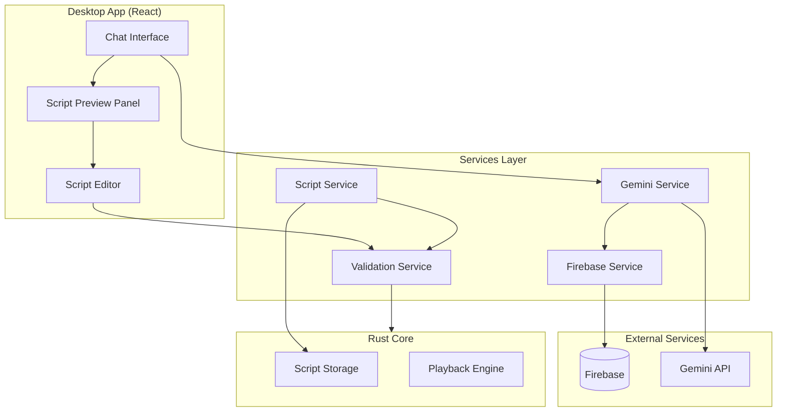

# Design Document: AI Script Builder

## Overview

AI Script Builder là một tính năng cho phép người dùng tạo automation test scripts thông qua giao diện chat với AI. Hệ thống sử dụng Gemini API để hiểu yêu cầu ngôn ngữ tự nhiên và sinh ra các script tương thích với rust-core format.

### Key Features
- Chat interface để mô tả test scenarios
- Tích hợp Gemini API để sinh script
- Quản lý API key qua Firebase
- Preview và edit script trước khi lưu
- Validation đảm bảo tương thích với rust-core

## Architecture



## Components and Interfaces

### 1. Chat Interface Component

```typescript
// ChatMessage type
interface ChatMessage {
  id: string;
  role: 'user' | 'assistant' | 'system';
  content: string;
  timestamp: Date;
  scriptPreview?: ScriptData;
}

// ChatInterfaceProps
interface ChatInterfaceProps {
  onScriptGenerated: (script: ScriptData) => void;
  apiKeyConfigured: boolean;
}

// ChatInterfaceState
interface ChatInterfaceState {
  messages: ChatMessage[];
  inputValue: string;
  isLoading: boolean;
  error: string | null;
}
```

### 2. Gemini Service

```typescript
interface GeminiService {
  // Initialize with API key
  initialize(apiKey: string): Promise<void>;
  
  // Generate script from user prompt
  generateScript(
    prompt: string,
    context: ConversationContext
  ): Promise<GenerationResult>;
  
  // Refine existing script based on feedback
  refineScript(
    currentScript: ScriptData,
    feedback: string
  ): Promise<GenerationResult>;
}

interface ConversationContext {
  previousMessages: ChatMessage[];
  currentScript?: ScriptData;
  availableActions: ActionType[];
}

interface GenerationResult {
  success: boolean;
  script?: ScriptData;
  message: string;
  needsClarification?: boolean;
  clarificationQuestions?: string[];
}
```

### 3. Firebase API Key Service

```typescript
interface ApiKeyService {
  // Store encrypted API key
  storeApiKey(userId: string, apiKey: string): Promise<void>;
  
  // Retrieve and decrypt API key
  getApiKey(userId: string): Promise<string | null>;
  
  // Check if API key exists
  hasApiKey(userId: string): Promise<boolean>;
  
  // Delete API key
  deleteApiKey(userId: string): Promise<void>;
}
```

### 4. Script Validation Service

```typescript
interface ScriptValidationService {
  // Validate entire script
  validateScript(script: ScriptData): ValidationResult;
  
  // Validate single action
  validateAction(action: Action): ValidationResult;
  
  // Check rust-core compatibility
  checkCompatibility(script: ScriptData): CompatibilityResult;
}

interface ValidationResult {
  valid: boolean;
  errors: ValidationError[];
  warnings: ValidationWarning[];
}

interface ValidationError {
  field: string;
  message: string;
  actionIndex?: number;
}
```

### 5. Script Preview Component

```typescript
interface ScriptPreviewProps {
  script: ScriptData | null;
  onEdit: (script: ScriptData) => void;
  onSave: (script: ScriptData) => void;
  onDiscard: () => void;
  validationResult: ValidationResult;
}
```

## Data Models

### Script Data (rust-core compatible)

```typescript
interface ScriptData {
  version: string;
  metadata: ScriptMetadata;
  actions: Action[];
}

interface ScriptMetadata {
  created_at: string; // ISO 8601
  duration: number;
  action_count: number;
  core_type: string;
  platform: string;
  screen_resolution?: [number, number];
  additional_data?: Record<string, unknown>;
}

interface Action {
  type: ActionType;
  timestamp: number;
  x?: number;
  y?: number;
  button?: 'left' | 'right' | 'middle';
  key?: string;
  text?: string;
  modifiers?: string[];
  additional_data?: Record<string, unknown>;
}

type ActionType = 
  | 'mouse_move'
  | 'mouse_click'
  | 'mouse_double_click'
  | 'mouse_drag'
  | 'mouse_scroll'
  | 'key_press'
  | 'key_release'
  | 'key_type'
  | 'screenshot'
  | 'wait'
  | 'custom';
```

### Gemini Prompt Template

```typescript
interface PromptTemplate {
  systemPrompt: string;
  actionSchema: string;
  exampleScripts: ScriptData[];
  userContext: string;
}

const SYSTEM_PROMPT = `
You are an automation script generator. Generate scripts in JSON format compatible with the following schema:

Available Action Types:
- mouse_move: Move mouse to coordinates (requires x, y)
- mouse_click: Click at coordinates (requires x, y, button)
- key_press: Press a key (requires key)
- key_type: Type text (requires text)
- wait: Wait for duration (requires timestamp delta)

Output Format:
{
  "version": "1.0",
  "metadata": { ... },
  "actions": [ ... ]
}

Rules:
1. All timestamps must be in seconds, increasing order
2. Mouse coordinates must be positive integers
3. Key names must be valid key identifiers
4. Include appropriate wait times between actions
`;
```

### Firebase API Key Storage

```typescript
interface StoredApiKey {
  userId: string;
  encryptedKey: string;
  createdAt: Date;
  updatedAt: Date;
}
```

## Correctness Properties

*A property is a characteristic or behavior that should hold true across all valid executions of a system-essentially, a formal statement about what the system should do. Properties serve as the bridge between human-readable specifications and machine-verifiable correctness guarantees.*

### Property 1: API Key Storage Round-Trip

*For any* valid Gemini API key and user ID, storing the key and then retrieving it should return the original key value.

**Validates: Requirements 1.1, 1.2, 1.4**

### Property 2: Message History Consistency

*For any* sequence of chat messages (user or AI), all messages should appear in the chat history in chronological order, and the total count should equal the number of messages sent plus received.

**Validates: Requirements 2.2, 2.4, 2.5**

### Property 3: Prompt Context Inclusion

*For any* user request sent to Gemini API, the prompt should contain the complete list of available action types and their required parameters.

**Validates: Requirements 3.1**

### Property 4: Script Parsing Validity

*For any* valid JSON script string returned by Gemini, parsing it should produce a ScriptData object with all required fields populated.

**Validates: Requirements 3.2**

### Property 5: Generated Script Validity

*For any* script generated by the AI, the script should pass validation against the rust-core schema, including: valid action types, valid coordinates for mouse actions, valid key codes for keyboard actions, and timestamps in ascending order.

**Validates: Requirements 3.3, 6.1, 6.2, 6.3, 6.4**

### Property 6: Script Modification Validation

*For any* user modification to a script action, the validation service should immediately check the modification and return a validation result.

**Validates: Requirements 4.2**

### Property 7: Script Serialization Round-Trip

*For any* valid ScriptData object, serializing to JSON and deserializing back should produce an equivalent ScriptData object.

**Validates: Requirements 4.3, 6.5**

### Property 8: Suggestion Relevance

*For any* user input text containing action keywords (click, type, wait, etc.), the suggestion system should return suggestions containing at least one matching action type.

**Validates: Requirements 5.2**

### Property 9: Example Prompt Population

*For any* example prompt selected by the user, the input field should contain exactly the text of the selected example.

**Validates: Requirements 5.4**

### Property 10: Script Preview Completeness

*For any* valid generated script, the preview should display all actions with their type, parameters, and human-readable descriptions.

**Validates: Requirements 3.5, 4.4**

## Error Handling

### API Key Errors

| Error | Handling |
|-------|----------|
| No API key configured | Show configuration prompt with instructions |
| Invalid API key | Display error message, prompt for re-entry |
| Firebase connection failed | Show retry option, cache last known state |
| Decryption failed | Clear stored key, request new key |

### Gemini API Errors

| Error | Handling |
|-------|----------|
| Rate limit exceeded | Show wait message with countdown |
| Invalid response format | Retry with simplified prompt |
| Network timeout | Show retry button, preserve user input |
| Content filtered | Inform user, suggest rephrasing |

### Script Validation Errors

| Error | Handling |
|-------|----------|
| Invalid action type | Highlight error, suggest valid types |
| Invalid coordinates | Show bounds, auto-correct if possible |
| Invalid key code | Show valid key list |
| Timestamp order violation | Auto-reorder or highlight conflict |

## Testing Strategy

### Unit Testing

Unit tests sẽ được viết cho các component và service riêng lẻ:

1. **GeminiService**: Test prompt construction, response parsing
2. **ApiKeyService**: Test encryption/decryption, Firebase operations
3. **ValidationService**: Test validation rules, error detection
4. **ChatInterface**: Test message handling, state management

### Property-Based Testing

Sử dụng **fast-check** library cho TypeScript property-based testing.

Mỗi property test sẽ:
- Chạy tối thiểu 100 iterations
- Được annotate với reference đến correctness property
- Test các invariants trên random inputs

```typescript
// Example property test annotation
/**
 * **Feature: ai-script-builder, Property 7: Script Serialization Round-Trip**
 * **Validates: Requirements 4.3, 6.5**
 */
test('script serialization round-trip', () => {
  fc.assert(
    fc.property(scriptDataArbitrary, (script) => {
      const serialized = JSON.stringify(script);
      const deserialized = JSON.parse(serialized);
      expect(deserialized).toEqual(script);
    }),
    { numRuns: 100 }
  );
});
```

### Integration Testing

1. **End-to-end chat flow**: User input → Gemini → Script generation → Preview
2. **API key lifecycle**: Store → Retrieve → Update → Delete
3. **Script save flow**: Generate → Edit → Validate → Save → Load

