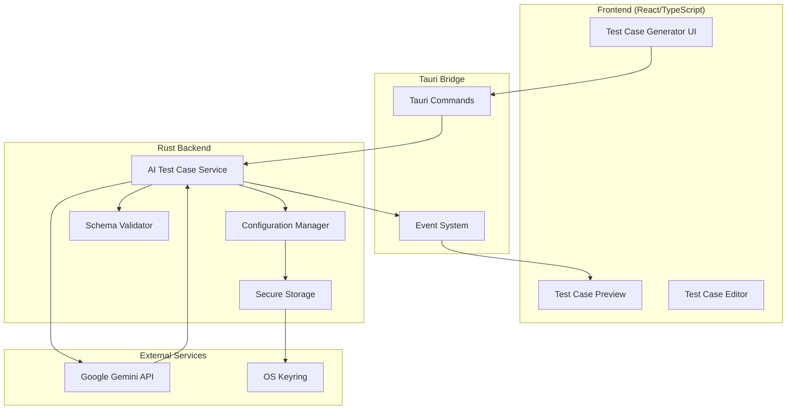

# Design Document

## Overview

The AI Test Case Generator is a Rust-based backend service integrated into GeniusQA's Tauri desktop application that leverages Google Gemini API to automatically generate comprehensive test case documentation. The system provides two primary workflows: converting natural language requirements into structured test cases, and transforming recorded automation logs into human-readable test documentation.

The design follows GeniusQA's existing architecture patterns, utilizing Rust for type-safe backend processing, Tauri for frontend-backend communication, and React for the user interface. The system integrates seamlessly with existing AI services while providing enhanced documentation capabilities specifically focused on test case generation rather than automation script creation.

## Architecture

### High-Level Architecture



### Component Integration

The AI Test Case Generator integrates with existing GeniusQA components:

- **Existing AI Script Builder**: Shares prompt engineering patterns and API management approaches
- **Rust Automation Core**: Leverages existing Rust infrastructure and patterns
- **Desktop Recorder**: Consumes recorded action logs for documentation generation
- **Test Case Management**: Provides generated test cases to existing test management workflows

## Components and Interfaces

### Core Service Module (`ai_test_case_service.rs`)

```rust
pub struct AITestCaseService {
    client: reqwest::Client,
    config: Arc<RwLock<ServiceConfig>>,
    validator: TestCaseValidator,
}

impl AITestCaseService {
    pub async fn generate_from_requirements(
        &self, 
        requirements: &str,
        options: GenerationOptions
    ) -> Result<Vec<TestCase>, ServiceError>;
    
    pub async fn generate_from_actions(
        &self,
        actions: &[RecordedAction],
        context: DocumentationContext
    ) -> Result<TestCaseDocumentation, ServiceError>;
    
    pub async fn validate_api_key(&self, api_key: &str) -> Result<bool, ServiceError>;
}
```

### Configuration Manager (`config_manager.rs`)

```rust
pub struct ConfigManager {
    keyring: keyring::Entry,
    app_config: AppConfig,
}

impl ConfigManager {
    pub async fn store_api_key(&self, api_key: &str) -> Result<(), ConfigError>;
    pub async fn retrieve_api_key(&self) -> Result<Option<String>, ConfigError>;
    pub fn get_generation_preferences(&self) -> GenerationPreferences;
    pub fn update_preferences(&mut self, prefs: GenerationPreferences) -> Result<(), ConfigError>;
}
```

### Schema Validator (`schema_validator.rs`)

```rust
pub struct TestCaseValidator;

impl TestCaseValidator {
    pub fn validate_test_case(&self, test_case: &TestCase) -> ValidationResult;
    pub fn validate_test_cases(&self, test_cases: &[TestCase]) -> Vec<ValidationResult>;
    pub fn auto_fix_test_case(&self, test_case: &mut TestCase) -> Vec<String>;
}
```

### Tauri Commands Interface

```rust
#[tauri::command]
async fn generate_test_cases_from_requirements(
    requirements: String,
    options: GenerationOptions,
    state: State<'_, AIServiceState>
) -> Result<GenerationResponse, String>;

#[tauri::command]
async fn generate_documentation_from_actions(
    actions: Vec<RecordedAction>,
    context: DocumentationContext,
    state: State<'_, AIServiceState>
) -> Result<DocumentationResponse, String>;

#[tauri::command]
async fn configure_api_key(
    api_key: String,
    state: State<'_, AIServiceState>
) -> Result<ConfigurationResponse, String>;

#[tauri::command]
async fn get_generation_preferences(
    state: State<'_, AIServiceState>
) -> Result<GenerationPreferences, String>;
```

## Data Models

### Core Data Structures

```rust
#[derive(Debug, Serialize, Deserialize, Clone)]
pub struct TestCase {
    pub id: String,
    pub title: String,
    pub description: String,
    pub preconditions: Option<String>,
    pub steps: Vec<TestStep>,
    pub expected_result: String,
    pub severity: TestSeverity,
    pub test_type: TestType,
    pub metadata: TestCaseMetadata,
}

#[derive(Debug, Serialize, Deserialize, Clone)]
pub struct TestStep {
    pub order: u32,
    pub action: String,
    pub expected_outcome: Option<String>,
    pub notes: Option<String>,
}

#[derive(Debug, Serialize, Deserialize, Clone)]
pub enum TestSeverity {
    Critical,
    High,
    Medium,
    Low,
}

#[derive(Debug, Serialize, Deserialize, Clone)]
pub enum TestType {
    Functional,
    Integration,
    EdgeCase,
    ErrorHandling,
    Performance,
    Security,
    Accessibility,
}

#[derive(Debug, Serialize, Deserialize, Clone)]
pub struct TestCaseMetadata {
    pub created_at: DateTime<Utc>,
    pub generated_by: String, // "ai-gemini"
    pub source_type: SourceType,
    pub project_type: ProjectType,
    pub generation_version: String,
}

#[derive(Debug, Serialize, Deserialize, Clone)]
pub enum SourceType {
    Requirements,
    RecordedActions,
    Manual,
}

#[derive(Debug, Serialize, Deserialize, Clone)]
pub enum ProjectType {
    Web,
    Mobile,
    Api,
    Desktop,
}
```

### Request/Response Models

```rust
#[derive(Debug, Serialize, Deserialize)]
pub struct GenerationOptions {
    pub project_type: ProjectType,
    pub complexity_level: ComplexityLevel,
    pub include_edge_cases: bool,
    pub include_error_scenarios: bool,
    pub max_test_cases: Option<u32>,
    pub custom_context: Option<String>,
}

#[derive(Debug, Serialize, Deserialize)]
pub enum ComplexityLevel {
    Basic,      // 3-5 test cases
    Detailed,   // 5-10 test cases
    Comprehensive, // 10-20 test cases
}

#[derive(Debug, Serialize, Deserialize)]
pub struct GenerationResponse {
    pub success: bool,
    pub test_cases: Vec<TestCase>,
    pub message: String,
    pub metadata: ResponseMetadata,
}

#[derive(Debug, Serialize, Deserialize)]
pub struct ResponseMetadata {
    pub processing_time_ms: u64,
    pub token_usage: Option<TokenUsage>,
    pub api_version: String,
    pub generation_id: String,
}

#[derive(Debug, Serialize, Deserialize)]
pub struct TokenUsage {
    pub prompt_tokens: u32,
    pub completion_tokens: u32,
    pub total_tokens: u32,
}
```

### Gemini API Integration Models

```rust
#[derive(Serialize)]
struct GeminiRequest {
    contents: Vec<GeminiContent>,
    generation_config: GeminiGenerationConfig,
}

#[derive(Serialize)]
struct GeminiContent {
    parts: Vec<GeminiPart>,
}

#[derive(Serialize)]
struct GeminiPart {
    text: String,
}

#[derive(Serialize)]
struct GeminiGenerationConfig {
    temperature: f32,
    response_mime_type: String, // "application/json"
    max_output_tokens: u32,
}

#[derive(Deserialize)]
struct GeminiResponse {
    candidates: Option<Vec<GeminiCandidate>>,
    usage_metadata: Option<GeminiUsageMetadata>,
    error: Option<GeminiError>,
}

#[derive(Deserialize)]
struct GeminiCandidate {
    content: GeminiContent,
    finish_reason: String,
}

#[derive(Deserialize)]
struct GeminiUsageMetadata {
    prompt_token_count: u32,
    candidates_token_count: u32,
    total_token_count: u32,
}
```

## Correctness Properties

*A property is a characteristic or behavior that should hold true across all valid executions of a system-essentially, a formal statement about what the system should do. Properties serve as the bridge between human-readable specifications and machine-verifiable correctness guarantees.*

### Property Reflection

After reviewing all properties identified in the prework analysis, several redundancies and consolidation opportunities were identified:

**Redundant Properties Eliminated:**
- Properties 2.2 and 3.2 (API communication) can be consolidated into a single comprehensive API communication property
- Properties 5.1 and 5.4 (schema validation) overlap significantly and can be combined
- Properties 8.1 and 8.3 (error logging) can be merged into a comprehensive error logging property
- Properties 1.1 and 1.4 (API key storage operations) can be combined into a single key management property

**Properties Consolidated:**
- Multiple UI-specific properties (6.1, 6.2, 6.3, 6.6) represent specific examples rather than universal properties
- Configuration properties (9.1, 9.2) are specific scenarios rather than universal behaviors
- Error handling examples (1.5, 4.4, 8.2, 8.4, 10.2, 10.4) represent specific error scenarios

The remaining properties provide unique validation value and comprehensive coverage of the system's correctness requirements.

### Correctness Properties

Property 1: API Key Security Round Trip
*For any* valid API key string, storing it securely and then retrieving it should return the original key value without exposing the key in logs or UI during any operation
**Validates: Requirements 1.1, 1.3, 1.4**

Property 2: Input Validation Consistency  
*For any* input string, the system should consistently validate that non-empty, meaningful content is accepted while empty strings and whitespace-only strings are rejected
**Validates: Requirements 2.1**

Property 3: API Communication Protocol
*For any* valid request (requirements or action logs), the system should send properly structured prompts to Gemini API and handle responses consistently regardless of content
**Validates: Requirements 2.2, 3.2**

Property 4: JSON Schema Enforcement
*For any* generated test case data, all required fields (id, title, description, steps, expected_result, severity) must be present and properly typed according to the TestCase schema
**Validates: Requirements 5.1, 5.4**

Property 5: Retry Mechanism Bounds
*For any* malformed JSON response from Gemini, the system should attempt auto-repair or regeneration up to exactly 3 times before failing gracefully, never exceeding this limit
**Validates: Requirements 5.3**

Property 6: Action Log Conversion Consistency
*For any* set of recorded actions, converting them to descriptive text format should produce consistent, readable output that preserves the essential information from the original actions
**Validates: Requirements 3.1**

Property 7: Async Operation Non-Blocking
*For any* API call to Gemini, the operation should complete asynchronously without blocking the UI thread, allowing continued user interaction
**Validates: Requirements 4.1**

Property 8: Timeout Enforcement
*For any* API request, if the operation exceeds 30 seconds, the system should terminate the request and provide appropriate error messaging
**Validates: Requirements 4.3**

Property 9: Concurrent Request Isolation
*For any* number of simultaneous generation requests, each should complete independently without interfering with others' results or state
**Validates: Requirements 4.5**

Property 10: Test Step Structure Consistency
*For any* generated test steps, each should include order, action description, and optional expected outcome fields with proper data types
**Validates: Requirements 5.2**

Property 11: Metadata Population Completeness
*For any* generated documentation, the system should auto-populate all metadata fields (created_at, generated_by, source_type, project_type) with valid values
**Validates: Requirements 3.4**

Property 12: Test Case Addition Preservation
*For any* selected test cases, adding them to the project should preserve all original data and metadata without corruption or loss
**Validates: Requirements 6.4**

Property 13: Markdown Rendering Fidelity
*For any* test case content containing Markdown syntax (bold, code blocks, lists), the UI should render all formatting correctly and consistently
**Validates: Requirements 6.5**

Property 14: Project Type Context Inclusion
*For any* generation request, the configured Project Type and application domain should be included in the AI prompt to ensure contextual relevance
**Validates: Requirements 7.1**

Property 15: Comprehensive Error Logging
*For any* API error or JSON parsing failure, the system should log detailed information including timestamps, request/response data, and error details for debugging
**Validates: Requirements 8.1, 8.3**

Property 16: Performance Monitoring Consistency
*For any* completed API operation, the system should track response times, success rates, and token usage counts when provided by the API
**Validates: Requirements 8.5**

Property 17: Preference Application Consistency
*For any* user preferences regarding test types (performance, security, accessibility), the generation process should respect these settings consistently across all requests
**Validates: Requirements 9.3**

Property 18: Custom Template Processing
*For any* valid custom prompt template, the system should apply the template consistently to generate output in the specified format
**Validates: Requirements 9.4**

Property 19: Preference Persistence Round Trip
*For any* preference updates, storing the settings and then retrieving them should return the exact same configuration values
**Validates: Requirements 9.5**

Property 20: Token Usage Logging Completeness
*For any* completed AI request, if token usage data is provided by the API, the system should log input tokens, output tokens, and total tokens accurately
**Validates: Requirements 10.1**

Property 21: Cost Information Display Accuracy
*For any* generation results with token usage data, the estimated cost information should be calculated and displayed correctly based on current API pricing
**Validates: Requirements 10.3**

Property 22: Usage Pattern Tracking Consistency
*For any* time period (daily/monthly), the system should accurately track and maintain request counts for user awareness and quota management
**Validates: Requirements 10.5**

## Error Handling

### Error Categories and Strategies

**API Communication Errors:**
- Network connectivity issues: Implement exponential backoff with jitter
- Rate limiting: Respect API limits with intelligent retry scheduling
- Authentication failures: Clear error messages with re-authentication prompts
- Malformed responses: JSON repair attempts with fallback to regeneration

**Data Validation Errors:**
- Schema validation failures: Detailed field-level error reporting
- Type conversion errors: Graceful degradation with user-friendly messages
- Missing required fields: Auto-completion where possible, user prompts otherwise

**System Resource Errors:**
- Memory constraints: Streaming processing for large datasets
- Storage failures: Fallback to temporary storage with user notification
- Concurrent access conflicts: Lock-free data structures where possible

**User Input Errors:**
- Invalid API keys: Immediate validation with specific error guidance
- Malformed requirements: Input sanitization with helpful suggestions
- Configuration errors: Validation with corrective action recommendations

### Error Recovery Mechanisms

```rust
#[derive(Debug, thiserror::Error)]
pub enum ServiceError {
    #[error("API communication failed: {message}")]
    ApiError { message: String, retry_after: Option<Duration> },
    
    #[error("JSON parsing failed: {details}")]
    ParseError { details: String, raw_response: String },
    
    #[error("Validation failed: {field} - {message}")]
    ValidationError { field: String, message: String },
    
    #[error("Configuration error: {message}")]
    ConfigError { message: String },
    
    #[error("Rate limit exceeded, retry after {seconds} seconds")]
    RateLimitError { seconds: u64 },
}

impl ServiceError {
    pub fn is_retryable(&self) -> bool {
        matches!(self, ServiceError::ApiError { .. } | ServiceError::RateLimitError { .. })
    }
    
    pub fn retry_delay(&self) -> Option<Duration> {
        match self {
            ServiceError::ApiError { retry_after, .. } => *retry_after,
            ServiceError::RateLimitError { seconds } => Some(Duration::from_secs(*seconds)),
            _ => None,
        }
    }
}
```

## Testing Strategy

### Dual Testing Approach

The AI Test Case Generator requires both unit testing and property-based testing to ensure comprehensive correctness validation:

**Unit Testing Focus:**
- API key encryption/decryption with known test keys
- JSON schema validation with specific test case structures  
- Error handling for specific failure scenarios (network errors, invalid API keys)
- UI component behavior with mock data
- Configuration management with predefined settings

**Property-Based Testing Focus:**
- API key security round trip with generated key strings (Property 1)
- Input validation consistency across random input strings (Property 2)
- JSON schema enforcement with generated test case data (Property 4)
- Retry mechanism bounds with simulated failures (Property 5)
- Concurrent request isolation with multiple simultaneous operations (Property 9)
- Preference persistence round trip with random configuration values (Property 19)

**Property-Based Testing Configuration:**
- Minimum 100 iterations per property test to ensure statistical confidence
- Custom generators for TestCase structures, API keys, and user preferences
- Shrinking strategies for complex data structures to isolate minimal failing cases
- Each property test tagged with format: `**Feature: ai-test-case-generator, Property {number}: {property_text}**`

**Testing Framework Selection:**
- **Unit Tests**: Standard Rust `#[cfg(test)]` modules with `tokio-test` for async operations
- **Property Tests**: `proptest` crate for property-based testing with custom generators
- **Integration Tests**: Tauri's testing framework for frontend-backend integration
- **API Mocking**: `wiremock` for simulating Gemini API responses during testing

**Test Data Management:**
- Synthetic test data generation for API responses
- Anonymized real-world examples for validation testing
- Edge case datasets for boundary condition testing
- Performance benchmarks with large-scale data sets

### Test Coverage Requirements

**Critical Path Coverage:**
- All API communication pathways (success and failure scenarios)
- Complete error handling and recovery mechanisms
- Security-sensitive operations (API key management, data encryption)
- User workflow integration points

**Performance Testing:**
- Response time validation under various load conditions
- Memory usage monitoring during large test case generation
- Concurrent request handling capacity verification
- API rate limiting compliance testing

**Security Testing:**
- API key storage and retrieval security validation
- Data encryption verification
- Input sanitization effectiveness
- Error message information leakage prevention
