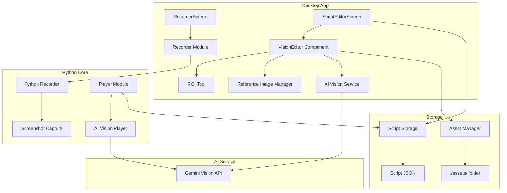
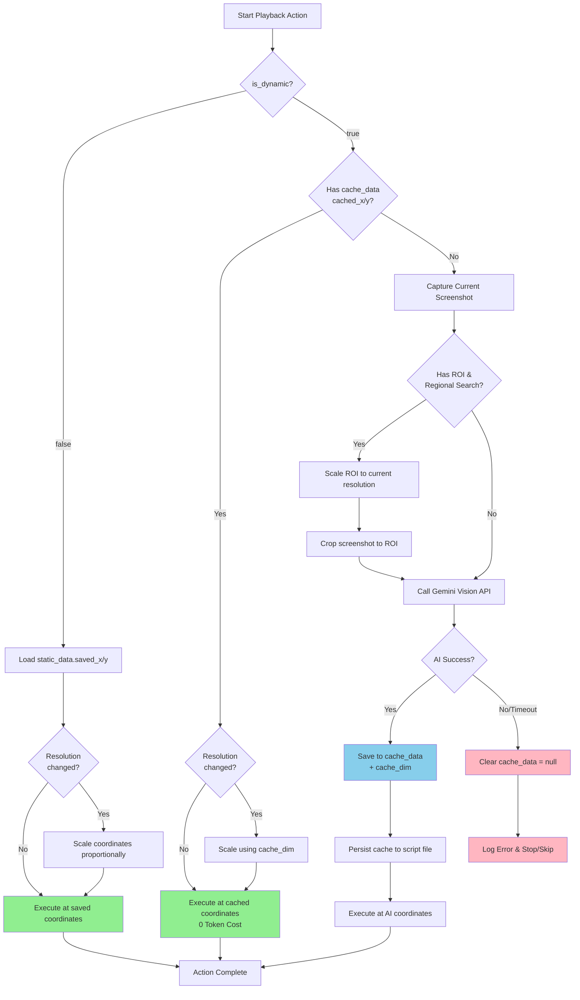
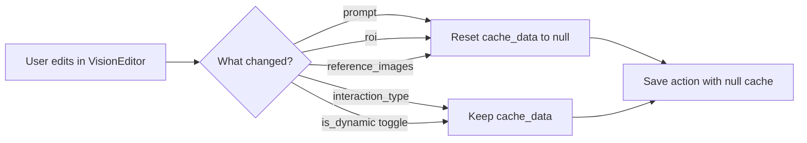

# Design Document: AI Vision Capture

## Overview

AI Vision Capture là tính năng cho phép người dùng chèn các điểm đánh dấu AI vào quá trình ghi script. Tính năng này hỗ trợ 2 chế độ:

1. **Static Mode (mặc định)**: AI phân tích ngay khi edit, lưu tọa độ cố định, playback không tốn token
2. **Dynamic Mode**: Lưu prompt/reference images, gọi AI khi playback để tìm element trên màn hình hiện tại

Tính năng bao gồm:
- Hotkey (Cmd+F6 / Ctrl+F6) để chụp màn hình trong khi recording
- Editor với ROI tool, prompt input, và reference image support
- AI service integration để phân tích ảnh và trả về tọa độ
- Hybrid playback logic cho cả Static và Dynamic mode

## Architecture

### System Architecture



### Playback Data Flow (Static → Cache → AI)



### Editor Cache Invalidation Flow



## Components and Interfaces

### 1. AIVisionCapture Action Type

Mở rộng action types hiện có để hỗ trợ ai_vision_capture:

```typescript
// packages/desktop/src/types/aiVisionCapture.types.ts

export type InteractionType = 'click' | 'dblclick' | 'rclick' | 'hover';
export type SearchScope = 'global' | 'regional';

export interface VisionROI {
  x: number;
  y: number;
  width: number;
  height: number;
}

export interface AIVisionCaptureAction {
  type: 'ai_vision_capture';
  id: string;
  timestamp: number;
  is_dynamic: boolean;
  interaction: InteractionType;
  static_data: {
    original_screenshot: string;  // path to screenshot
    saved_x: number | null;
    saved_y: number | null;
    screen_dim: [number, number]; // [width, height]
  };
  dynamic_config: {
    prompt: string;
    reference_images: string[];   // paths to reference images
    roi: VisionROI | null;
    search_scope: SearchScope;
  };
  cache_data: {
    cached_x: number | null;      // cached coordinate from successful Dynamic AI
    cached_y: number | null;
    cache_dim: [number, number] | null; // screen dimensions when cache was created
  };
}
```

### 2. VisionEditor Component

Component chính để chỉnh sửa ai_vision_capture actions:

```typescript
// packages/desktop/src/components/VisionEditor.tsx

interface VisionEditorProps {
  action: AIVisionCaptureAction;
  onUpdate: (action: AIVisionCaptureAction) => void;
  onAnalyze: () => Promise<void>;
}

interface VisionEditorState {
  isAnalyzing: boolean;
  error: string | null;
  markerPosition: { x: number; y: number } | null;
}

/**
 * CRITICAL: Cache Invalidation Logic
 * 
 * When any field in dynamic_config changes (prompt, roi, reference_images),
 * the cache_data MUST be reset to prevent stale cached coordinates.
 * 
 * Implementation:
 * - Use useEffect to watch dynamic_config changes
 * - If cache_data has values AND dynamic_config changed, reset cache_data
 */
const handleDynamicConfigChange = (
  newConfig: Partial<DynamicConfig>,
  currentAction: AIVisionCaptureAction
): AIVisionCaptureAction => {
  const hasExistingCache = 
    currentAction.cache_data.cached_x !== null || 
    currentAction.cache_data.cached_y !== null;
  
  return {
    ...currentAction,
    dynamic_config: { ...currentAction.dynamic_config, ...newConfig },
    // Reset cache when dynamic_config changes
    cache_data: hasExistingCache 
      ? { cached_x: null, cached_y: null, cache_dim: null }
      : currentAction.cache_data
  };
};
```

### 3. ROI Tool Component

Component để vẽ và resize vùng ROI:

```typescript
// packages/desktop/src/components/ROITool.tsx

interface ROIToolProps {
  imageUrl: string;
  roi: VisionROI | null;
  onROIChange: (roi: VisionROI) => void;
  markerPosition?: { x: number; y: number };
  onMarkerDrag?: (position: { x: number; y: number }) => void;
}
```

### 4. Reference Image Manager

Component quản lý reference images:

```typescript
// packages/desktop/src/components/ReferenceImageManager.tsx

interface ReferenceImageManagerProps {
  images: string[];
  onImagesChange: (images: string[]) => void;
  assetsDir: string;
}
```

### 5. AI Vision Service

Service để gọi AI phân tích ảnh:

```typescript
// packages/desktop/src/services/aiVisionService.ts

interface AIVisionRequest {
  screenshot: string;           // base64 or path
  prompt: string;
  reference_images: string[];   // base64 or paths
  roi?: VisionROI;
}

interface AIVisionResponse {
  success: boolean;
  x?: number;
  y?: number;
  confidence?: number;
  error?: string;
}

class AIVisionService {
  async analyze(request: AIVisionRequest): Promise<AIVisionResponse>;
  setTimeout(ms: number): void;
}
```

### 6. Asset Manager

Module quản lý lưu trữ ảnh với cross-platform path normalization và unique file naming:

```typescript
// packages/desktop/src/services/assetManager.ts

class AssetManager {
  constructor(scriptPath: string);
  
  /**
   * Save reference image with auto-generated unique filename.
   * @param imageData - Blob or base64 string
   * @param actionId - UUID of the action (for unique naming)
   * @returns Relative path in POSIX format (e.g., "assets/vision_abc123_1702123456789.png")
   */
  async saveReferenceImage(imageData: Blob | string, actionId: string): Promise<string>;
  
  /**
   * Load reference image, converting POSIX path to OS-native if needed.
   * @param relativePath - Path in POSIX format from script JSON
   * @returns Base64 encoded image data
   */
  async loadReferenceImage(relativePath: string): Promise<string>;
  
  async deleteReferenceImage(relativePath: string): Promise<void>;
  getAssetsDir(): string;
  
  /**
   * Normalize path to POSIX format for storage (always use forward slashes).
   */
  static toPosixPath(path: string): string;
  
  /**
   * Convert POSIX path to OS-native format for file operations.
   */
  static toNativePath(posixPath: string): string;
  
  /**
   * Generate unique filename: vision_{actionId}_{timestamp}.{ext}
   */
  private generateUniqueFilename(actionId: string, extension: string): string;
}
```

### 7. Python Recorder Extension

Mở rộng Python Recorder để hỗ trợ hotkey:

```python
# packages/python-core/src/recorder/recorder.py

class Recorder:
    def _on_key_event(self, key, pressed: bool) -> None:
        # Detect Cmd+F6 (macOS) or Ctrl+F6 (Windows/Linux)
        if self._is_vision_capture_hotkey(key, pressed):
            self._capture_vision_marker()
    
    def _capture_vision_marker(self) -> None:
        """Capture screenshot and create ai_vision_capture action."""
        pass
```

### 8. Python Player Extension

Mở rộng Python Player để xử lý ai_vision_capture:

```python
# packages/python-core/src/player/player.py

class Player:
    def _execute_ai_vision_capture(self, action: dict) -> None:
        """Execute ai_vision_capture action based on mode.
        
        Priority order:
        1. Static Mode (saved_x/y) - 0 token cost
        2. Dynamic Cache (cached_x/y) - 0 token cost
        3. Dynamic Mode (Call AI) - token cost, then cache result
        """
        if not action.get('is_dynamic', False):
            self._execute_static_vision(action)
        elif self._has_valid_cache(action):
            self._execute_cached_vision(action)
        else:
            self._execute_dynamic_vision(action)
    
    def _has_valid_cache(self, action: dict) -> bool:
        """Check if action has valid cached coordinates."""
        cache = action.get('cache_data', {})
        return cache.get('cached_x') is not None and cache.get('cached_y') is not None
    
    def _execute_cached_vision(self, action: dict) -> None:
        """Execute using cached coordinates (0 token cost)."""
        pass
    
    def _save_to_cache(self, action: dict, x: int, y: int, screen_dim: tuple) -> None:
        """Save AI result to cache for future runs."""
        pass
```

## Data Models

### Script File Schema Extension

```json
{
  "metadata": {
    "version": "1.1",
    "created_at": "2024-12-09T10:00:00Z",
    "duration": 45.5,
    "action_count": 10,
    "platform": "darwin"
  },
  "actions": [
    {
      "type": "ai_vision_capture",
      "id": "uuid-1234",
      "timestamp": 5.0,
      "is_dynamic": true,
      "interaction": "click",
      "static_data": {
        "original_screenshot": "screenshots/vision_001.png",
        "saved_x": null,
        "saved_y": null,
        "screen_dim": [1920, 1080]
      },
      "dynamic_config": {
        "prompt": "Click the Submit button",
        "reference_images": ["assets/submit_icon.png"],
        "roi": { "x": 400, "y": 200, "width": 200, "height": 100 },
        "search_scope": "regional"
      },
      "cache_data": {
        "cached_x": 520,
        "cached_y": 280,
        "cache_dim": [1920, 1080]
      }
    }
  ]
}
```

### Python Model Extension

```python
# packages/python-core/src/storage/models.py

class VisionROI(BaseModel):
    x: int
    y: int
    width: int
    height: int

class StaticData(BaseModel):
    original_screenshot: str
    saved_x: Optional[int] = None
    saved_y: Optional[int] = None
    screen_dim: tuple[int, int]

class DynamicConfig(BaseModel):
    prompt: str = ""
    reference_images: list[str] = []
    roi: Optional[VisionROI] = None
    search_scope: Literal['global', 'regional'] = 'global'

class CacheData(BaseModel):
    cached_x: Optional[int] = None
    cached_y: Optional[int] = None
    cache_dim: Optional[tuple[int, int]] = None

class AIVisionCaptureAction(BaseModel):
    type: Literal['ai_vision_capture']
    id: str
    timestamp: float
    is_dynamic: bool = False
    interaction: Literal['click', 'dblclick', 'rclick', 'hover'] = 'click'
    static_data: StaticData
    dynamic_config: DynamicConfig
    cache_data: CacheData = CacheData()
```

## Correctness Properties

*A property is a characteristic or behavior that should hold true across all valid executions of a system-essentially, a formal statement about what the system should do. Properties serve as the bridge between human-readable specifications and machine-verifiable correctness guarantees.*

### Property 1: AI Vision Capture Action Schema Validation
*For any* ai_vision_capture action object, it SHALL contain all required fields (type, id, timestamp, is_dynamic, interaction, static_data, dynamic_config) with correct types and valid values.
**Validates: Requirements 5.1, 5.2, 5.3**

### Property 2: Round-trip Serialization Consistency
*For any* valid ai_vision_capture action, serializing to JSON and then deserializing SHALL produce an equivalent action object with identical field values.
**Validates: Requirements 5.6**

### Property 3: Coordinate Scaling Proportionality
*For any* saved coordinates (x, y) and screen dimensions, when the playback screen resolution differs from the recorded resolution, the scaled coordinates SHALL be proportional: `scaled_x / new_width == original_x / original_width` and `scaled_y / new_height == original_y / original_height`.
**Validates: Requirements 4.3, 4.5**

### Property 4: Static Mode Zero AI Calls
*For any* ai_vision_capture action with is_dynamic = false and valid saved_x/saved_y, playback SHALL execute the interaction at the saved coordinates without making any AI API calls.
**Validates: Requirements 4.3**

### Property 5: Dynamic Cache Zero AI Calls
*For any* ai_vision_capture action with is_dynamic = true AND valid cached_x/cached_y, playback SHALL execute the interaction at the cached coordinates (with scaling if needed) without making any AI API calls.
**Validates: Requirements 4.5**

### Property 6: Dynamic Mode AI Request Structure
*For any* ai_vision_capture action with is_dynamic = true AND no valid cache, the AI request SHALL contain the current screenshot, user_prompt, and all reference_images from dynamic_config.
**Validates: Requirements 4.6, 4.8**

### Property 7: Cache Persistence After AI Success
*For any* successful Dynamic Mode AI call, the returned coordinates SHALL be saved to cache_data (cached_x, cached_y, cache_dim) and persisted to the script file.
**Validates: Requirements 4.9, 5.8**

### Property 8: Cache Invalidation On AI Failure
*For any* failed Dynamic Mode AI call (error or timeout), any existing cache_data SHALL be cleared (cached_x, cached_y set to null).
**Validates: Requirements 4.11**

### Property 9: Reference Image Asset Persistence
*For any* reference image added to an action, the image file SHALL be saved to the ./assets/ subdirectory relative to the script file, and the stored path SHALL be a valid relative path.
**Validates: Requirements 5.5, 2.6**

### Property 10: ROI Coordinate Bounds
*For any* vision_region (ROI), the coordinates SHALL satisfy: `0 <= x < screen_width`, `0 <= y < screen_height`, `x + width <= screen_width`, `y + height <= screen_height`.
**Validates: Requirements 2.2, 2.3, 2.4**

### Property 11: AI Timeout Enforcement
*For any* Dynamic Mode AI call, if the response is not received within the configured timeout (default 15 seconds), the system SHALL treat it as an error and not block indefinitely.
**Validates: Requirements 4.10, 4.11**

### Property 12: Default Mode Invariant
*For any* newly created ai_vision_capture action, is_dynamic SHALL default to false (Static Mode).
**Validates: Requirements 3.1**

### Property 13: Recording Continuity
*For any* recording session, pressing the vision capture hotkey SHALL NOT interrupt the capture of subsequent mouse and keyboard events.
**Validates: Requirements 1.3**

### Property 14: Playback Priority Order
*For any* ai_vision_capture action, the Player SHALL check modes in this exact order: (1) Static saved_x/y, (2) Dynamic cached_x/y, (3) Dynamic AI call. The first valid option SHALL be used.
**Validates: Requirements 4.1**

### Property 15: Editor Cache Invalidation
*For any* ai_vision_capture action with existing cache_data (cached_x/cached_y not null), IF any field in dynamic_config (prompt, roi, reference_images) is modified by the user in the Editor, THEN cache_data SHALL be reset to null immediately.
**Validates: Requirements 7.1, 7.2, 7.3**

### Property 16: Asset Path Normalization (Cross-Platform)
*For any* reference_image path stored in the script JSON, the path SHALL use POSIX format (forward slashes `/`) regardless of the operating system. When loading, the Asset_Manager SHALL convert to OS-native format if needed.
**Validates: Requirements 5.9, 5.10**

### Property 17: Asset File Naming Uniqueness
*For any* reference image saved via paste or drag-drop, the Asset_Manager SHALL generate a unique filename using the pattern `vision_{action_id}_{timestamp}.{ext}` to prevent filename collisions.
**Validates: Requirements 5.11**

## Error Handling

### Recording Errors
- **Screenshot capture failure**: Log error, continue recording without vision marker
- **Hotkey detection failure**: Fall back to manual trigger via UI

### Editor Errors
- **Image paste failure**: Display error toast, allow retry
- **AI analysis failure**: Display error message, allow manual coordinate input
- **Asset save failure**: Display error, suggest checking disk space/permissions

### Playback Errors
- **Static Mode - Missing coordinates**: Skip action, log warning
- **Dynamic Mode - AI timeout**: Clear cache, log error, stop or skip based on settings
- **Dynamic Mode - AI failure**: Clear cache, log error "AI Vision target not found", stop or skip
- **Cache Mode - Invalid cache**: Fall through to Dynamic Mode AI call
- **Resolution scaling overflow**: Clamp coordinates to screen bounds

### Error Response Format
```typescript
interface VisionError {
  code: 'SCREENSHOT_FAILED' | 'AI_TIMEOUT' | 'AI_FAILED' | 'ASSET_ERROR' | 'INVALID_COORDINATES';
  message: string;
  recoverable: boolean;
  suggestion?: string;
}
```

## Testing Strategy

### Property-Based Testing Library
- **TypeScript/React**: fast-check
- **Python**: hypothesis

### Unit Tests
- VisionEditor component rendering and state management
- ROI Tool coordinate calculations
- Asset Manager file operations
- AI Vision Service request/response handling

### Property-Based Tests
Each correctness property will be implemented as a property-based test:

1. **Schema Validation Property**: Generate random action objects, verify all required fields present
2. **Round-trip Property**: Generate random valid actions, serialize/deserialize, compare
3. **Scaling Property**: Generate random coordinates and resolutions, verify proportionality
4. **Static Mode Property**: Mock AI service, verify no calls made in static mode
5. **Cache Mode Property**: Mock AI service, verify no calls made when cache exists
6. **Dynamic Mode Property**: Mock AI service, verify request structure when no cache
7. **Cache Persistence Property**: Verify AI results are saved to cache_data after success
8. **Cache Invalidation Property**: Verify cache is cleared after AI failure
9. **Asset Persistence Property**: Generate random images, verify file creation and path validity
10. **ROI Bounds Property**: Generate random ROI values, verify bounds constraints
11. **Timeout Property**: Mock slow AI responses, verify timeout behavior
12. **Default Mode Property**: Create new actions, verify is_dynamic = false
13. **Recording Continuity Property**: Simulate hotkey during recording, verify events continue
14. **Priority Order Property**: Verify playback checks Static → Cache → Dynamic in order
15. **Editor Cache Invalidation Property**: Generate actions with cache, modify dynamic_config fields, verify cache is reset to null
16. **Asset Path Normalization Property**: Generate paths with mixed separators (\ and /), verify storage always uses POSIX format (/)
17. **Asset Filename Uniqueness Property**: Generate multiple images for same action, verify all filenames are unique and follow pattern `vision_{actionId}_{timestamp}.{ext}`

### Integration Tests
- End-to-end recording with vision capture hotkey
- Editor workflow: ROI → prompt → analyze → save
- Playback in both Static and Dynamic modes
- Cross-resolution playback with scaling

### Test Configuration
```typescript
// fast-check configuration
fc.configureGlobal({
  numRuns: 100,
  verbose: true,
});
```

```python
# hypothesis configuration
from hypothesis import settings
settings.register_profile("ci", max_examples=100)
```
