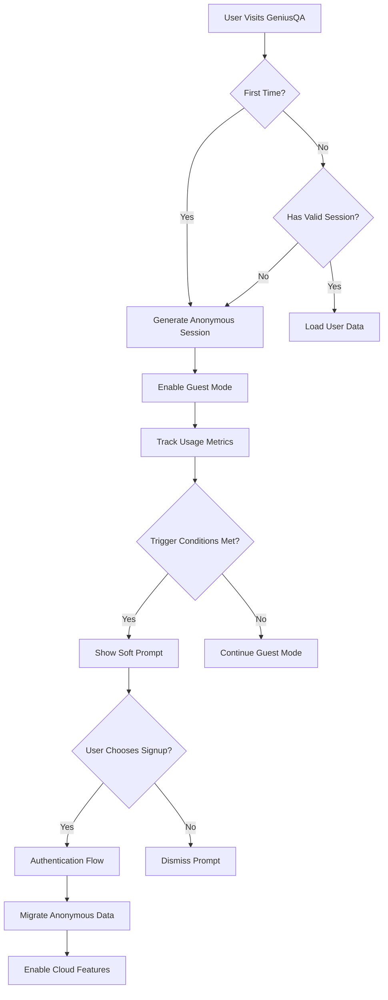
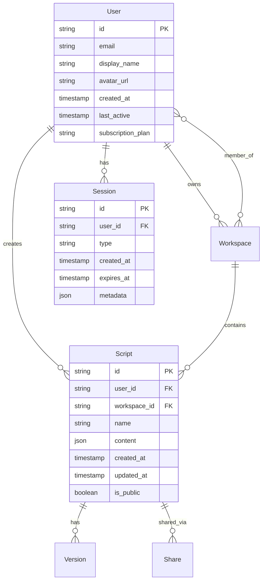

# Implementation Roadmap: GeniusQA Authentication Strategy

## Overview

This roadmap outlines the step-by-step implementation of the GeniusQA authentication strategy, focusing on delivering value incrementally while building toward the full vision of frictionless onboarding with progressive authentication.

## Implementation Phases

### Phase 1: Anonymous Foundation (Weeks 1-4)
**Goal:** Enable full basic functionality without authentication requirements

#### Week 1-2: Core Anonymous Experience
- **Task 1.1:** Implement anonymous session management
  - Generate unique session IDs for anonymous users
  - Set up local storage for script persistence
  - Create session expiration handling (30 days)
  
- **Task 1.2:** Enhanced local script management
  - Implement script CRUD operations in local storage
  - Add script organization (folders, search)
  - Create storage quota management and warnings
  
- **Task 1.3:** Guest mode UI indicators
  - Add subtle "Guest Mode" indicator to header
  - Create local storage icons for scripts
  - Design storage usage indicators

#### Week 3-4: Export/Import System
- **Task 1.4:** Multi-format export system
  - JSON export with full script metadata
  - JavaScript/Python code generation
  - Batch export functionality
  
- **Task 1.5:** Import validation and processing
  - File format validation
  - Script schema validation
  - Error handling and user feedback
  
- **Task 1.6:** Data migration utilities
  - Prepare migration functions for future cloud sync
  - Create data validation and cleanup utilities

**Deliverables:**
- ✅ Anonymous users can use all basic features
- ✅ Local script storage with organization
- ✅ Export/import functionality
- ✅ Clear guest mode indicators

---

### Phase 2: Progressive Authentication (Weeks 5-8)
**Goal:** Implement gentle authentication prompts and seamless signup

#### Week 5-6: Smart Prompting System
- **Task 2.1:** Prompt trigger system
  - Track user engagement metrics (scripts created, days active)
  - Implement smart timing for authentication prompts
  - Create dismissal preferences storage
  
- **Task 2.2:** Non-intrusive prompt UI
  - Design gentle prompt components
  - Focus on benefits messaging
  - Implement dismissal and "remind later" options
  
- **Task 2.3:** Feature preview system
  - Create preview components for gated features
  - Design upgrade CTAs and benefit explanations
  - Implement graceful degradation patterns

#### Week 7-8: Authentication Infrastructure
- **Task 2.4:** Multi-provider authentication
  - Integrate Firebase Authentication
  - Set up Google OAuth and GitHub OAuth
  - Implement email/password authentication
  
- **Task 2.5:** Seamless data migration
  - Create anonymous-to-authenticated migration service
  - Implement background migration with progress feedback
  - Handle migration failures and retry logic
  
- **Task 2.6:** Cross-platform session management
  - Implement JWT token handling
  - Create session refresh logic
  - Set up cross-platform authentication state

**Deliverables:**
- ✅ Smart authentication prompts based on usage
- ✅ Quick signup flow (< 60 seconds)
- ✅ Automatic migration of anonymous data
- ✅ Feature previews for gated functionality

---

### Phase 3: Cloud Integration (Weeks 9-12)
**Goal:** Enable cloud storage, sync, and basic sharing

#### Week 9-10: Cloud Storage Foundation
- **Task 3.1:** Cloud database setup
  - Set up Firestore/Supabase for script storage
  - Design data schema for scripts and user profiles
  - Implement security rules and access control
  
- **Task 3.2:** Real-time synchronization
  - Create sync service for script changes
  - Implement conflict resolution for simultaneous edits
  - Add offline support with sync when online
  
- **Task 3.3:** Cross-device access
  - Enable script access from multiple devices
  - Implement device management and session handling
  - Create sync status indicators in UI

#### Week 11-12: Sharing and Collaboration
- **Task 3.4:** Basic script sharing
  - Generate shareable links for scripts
  - Implement view/edit permissions
  - Create sharing UI and management
  
- **Task 3.5:** Version history system
  - Automatic versioning on script changes
  - Visual diff between versions
  - One-click revert functionality
  
- **Task 3.6:** User profile management
  - User profile creation and editing
  - Avatar upload and display
  - Account settings and preferences

**Deliverables:**
- ✅ Cloud script storage and sync
- ✅ Cross-device script access
- ✅ Basic script sharing capabilities
- ✅ Version history and rollback

---

### Phase 4: Advanced Features (Weeks 13-16)
**Goal:** Implement scheduled runs and cloud execution

#### Week 13-14: Automation Scheduling
- **Task 4.1:** Job scheduling system
  - Set up background job processing
  - Create scheduling UI and management
  - Implement recurring schedule patterns
  
- **Task 4.2:** Notification system
  - Email notifications for test results
  - Slack/Discord webhook integrations
  - In-app notification center
  
- **Task 4.3:** Execution monitoring
  - Real-time execution status tracking
  - Detailed execution logs and metrics
  - Failure analysis and reporting

#### Week 15-16: Cloud Execution Environment
- **Task 4.4:** Cloud browser integration
  - Integrate with cloud testing providers
  - Set up multiple browser/OS environments
  - Implement parallel execution capabilities
  
- **Task 4.5:** Resource management
  - Usage tracking and billing integration
  - Execution time limits and quotas
  - Cost optimization and reporting
  
- **Task 4.6:** Advanced reporting
  - Test execution analytics dashboard
  - Performance trends and insights
  - Custom report generation

**Deliverables:**
- ✅ Scheduled test execution
- ✅ Cloud browser testing environments
- ✅ Advanced analytics and reporting
- ✅ Resource usage tracking

---

### Phase 5: Team Features (Weeks 17-20)
**Goal:** Enable team collaboration and workspace management

#### Week 17-18: Team Workspaces
- **Task 5.1:** Multi-tenancy architecture
  - Design team workspace data model
  - Implement workspace creation and management
  - Set up team member invitation system
  
- **Task 5.2:** Role-based access control
  - Define roles: Admin, Editor, Viewer
  - Implement granular permissions system
  - Create permission management UI
  
- **Task 5.3:** Team analytics
  - Team-wide usage analytics
  - Collaboration metrics and insights
  - Team performance dashboards

#### Week 19-20: Real-time Collaboration
- **Task 5.4:** Collaborative editing
  - WebSocket-based real-time editing
  - Operational transformation for conflict resolution
  - User presence indicators and cursors
  
- **Task 5.5:** Communication features
  - Comment system for script review
  - Activity feeds for workspace changes
  - @mention notifications
  
- **Task 5.6:** Audit and compliance
  - Comprehensive audit logging
  - Team activity monitoring
  - Data retention policies

**Deliverables:**
- ✅ Team workspaces and member management
- ✅ Real-time collaborative editing
- ✅ Team analytics and insights
- ✅ Audit logging and compliance features

---

## Technical Architecture

### Authentication Flow

### Data Architecture

### Security Considerations

#### Authentication Security
- **JWT Tokens:** Short-lived access tokens (15 minutes) with refresh tokens
- **OAuth Integration:** Secure OAuth 2.0 flows with PKCE
- **Session Management:** Secure session storage with httpOnly cookies
- **Rate Limiting:** Prevent brute force attacks on authentication endpoints

#### Data Security
- **Encryption:** AES-256 encryption for sensitive data at rest
- **Transport Security:** TLS 1.3 for all data in transit
- **Access Control:** Row-level security in database
- **Audit Logging:** Comprehensive logging of all data access

#### Privacy Compliance
- **GDPR Compliance:** Right to deletion, data portability, consent management
- **Data Minimization:** Collect only necessary data
- **Anonymization:** Anonymous usage analytics with no PII
- **Consent Management:** Clear consent flows for data collection

## Monitoring and Analytics

### Key Metrics to Track

#### User Experience Metrics
- **Time to First Script:** Average time for new users to create first script
- **Anonymous Retention:** Percentage of anonymous users returning within 7 days
- **Authentication Conversion:** Percentage converting from anonymous to authenticated
- **Feature Adoption:** Usage rates of different features by user type

#### Business Metrics
- **Signup Conversion Rate:** Anonymous to authenticated conversion rate
- **Feature Upgrade Rate:** Free to paid feature conversion rate
- **User Lifetime Value:** Revenue per user by authentication status
- **Churn Rate:** User retention by authentication and subscription status

#### Technical Metrics
- **Authentication Success Rate:** Percentage of successful authentication attempts
- **Data Migration Success:** Percentage of successful anonymous data migrations
- **Sync Performance:** Average time for cross-device synchronization
- **System Availability:** Uptime for authentication and cloud services

### A/B Testing Framework

#### Authentication Prompt Testing
- **Prompt Timing:** Test different trigger conditions (3 vs 5 scripts, 7 vs 14 days)
- **Messaging:** Test benefit-focused vs feature-focused messaging
- **UI Design:** Test different prompt designs and placements
- **Frequency:** Test prompt frequency and dismissal behavior

#### Signup Flow Testing
- **Form Design:** Test single-step vs multi-step signup forms
- **OAuth Options:** Test different OAuth provider combinations
- **Onboarding:** Test different post-signup onboarding flows
- **Migration UX:** Test different data migration presentation approaches

## Risk Mitigation

### Technical Risks
- **Data Loss:** Implement robust backup and recovery systems
- **Performance Issues:** Load testing and performance monitoring
- **Security Vulnerabilities:** Regular security audits and penetration testing
- **Third-party Dependencies:** Fallback plans for OAuth providers and cloud services

### Business Risks
- **Low Conversion Rates:** Continuous A/B testing and UX optimization
- **User Confusion:** Clear documentation and onboarding flows
- **Competitive Pressure:** Regular feature comparison and differentiation
- **Regulatory Changes:** Proactive compliance monitoring and updates

### User Experience Risks
- **Authentication Friction:** Extensive user testing and feedback collection
- **Feature Complexity:** Progressive disclosure and contextual help
- **Data Migration Issues:** Comprehensive testing and rollback procedures
- **Cross-platform Inconsistencies:** Unified design system and testing

## Success Criteria

### Phase 1 Success Criteria
- [ ] 90% of new users can create their first script within 2 minutes
- [ ] 70% of anonymous users return within 7 days
- [ ] 95% of scripts are successfully saved to local storage
- [ ] Export/import success rate > 98%

### Phase 2 Success Criteria
- [ ] 25% of active anonymous users sign up within 30 days
- [ ] Signup completion rate > 85%
- [ ] Data migration success rate > 99%
- [ ] User satisfaction score > 4.5/5 for authentication experience

### Phase 3 Success Criteria
- [ ] 95% of authenticated users use cloud sync within first week
- [ ] Cross-device sync success rate > 99%
- [ ] Script sharing adoption rate > 40% among authenticated users
- [ ] Version history usage rate > 60% among active users

### Phase 4 Success Criteria
- [ ] 30% of authenticated users set up scheduled runs
- [ ] Cloud execution adoption rate > 20% among paid users
- [ ] Advanced analytics engagement rate > 50%
- [ ] Customer satisfaction with advanced features > 4.3/5

### Phase 5 Success Criteria
- [ ] 15% of authenticated users create team workspaces
- [ ] Real-time collaboration usage rate > 70% in team workspaces
- [ ] Team feature satisfaction score > 4.4/5
- [ ] Enterprise feature adoption rate > 25% among enterprise customers

## Conclusion

This implementation roadmap provides a structured approach to building GeniusQA's authentication strategy while maintaining the core principle of frictionless access. By implementing features incrementally and measuring success at each phase, we can ensure that the authentication system enhances rather than hinders the user experience.

The key to success will be continuous monitoring, user feedback collection, and iterative improvement based on real usage data and user behavior patterns.
