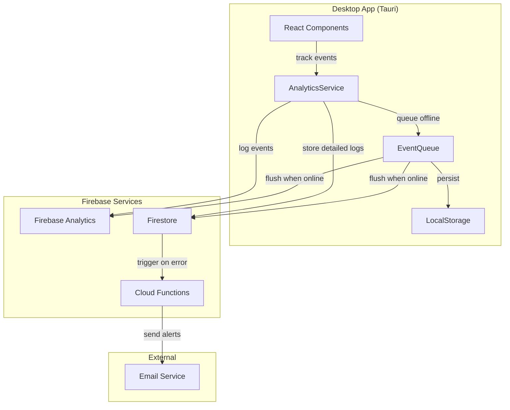

# Design Document: Desktop Analytics Logging

## Overview

Tính năng Desktop Analytics Logging cung cấp hệ thống tracking toàn diện cho GeniusQA Desktop App (Tauri). Hệ thống sử dụng Firebase Analytics để thu thập metrics, Firestore để lưu trữ detailed logs, và Firebase Cloud Functions để gửi email alerts.

### Architecture Approach

Do Tauri app chạy trong webview, chúng ta sẽ sử dụng Firebase JavaScript SDK trực tiếp trong React frontend. Điều này cho phép:
- Tận dụng Firebase SDK đầy đủ tính năng
- Không cần custom REST API implementation
- Automatic batching và offline support từ Firebase SDK

## Architecture



## Components and Interfaces

### 1. AnalyticsService

Core service quản lý tất cả analytics operations.

```typescript
// packages/desktop/src/services/analyticsService.ts

import { Analytics, logEvent, setUserId, setUserProperties } from 'firebase/analytics';
import { Firestore, collection, addDoc, writeBatch } from 'firebase/firestore';

export interface AnalyticsEvent {
  name: string;
  params: Record<string, any>;
  timestamp: number;
  sessionId: string;
  userId?: string;
}

export interface SessionInfo {
  sessionId: string;
  startTime: number;
  deviceInfo: DeviceInfo;
  appVersion: string;
}

export interface DeviceInfo {
  platform: string;
  osVersion: string;
  screenResolution: string;
  language: string;
}

export interface AnalyticsConfig {
  enabled: boolean;
  debugMode: boolean;
  batchSize: number;
  flushInterval: number; // milliseconds
  maxQueueSize: number;
}

export class AnalyticsService {
  private analytics: Analytics | null = null;
  private firestore: Firestore | null = null;
  private sessionInfo: SessionInfo | null = null;
  private config: AnalyticsConfig;
  private eventQueue: EventQueue;
  private consentGiven: boolean = false;
  private flushTimer: NodeJS.Timer | null = null;

  constructor(config?: Partial<AnalyticsConfig>);
  
  // Initialization
  async initialize(): Promise<void>;
  async checkConsent(): Promise<boolean>;
  async setConsent(consent: boolean): Promise<void>;
  
  // Event Tracking
  trackEvent(eventName: string, params?: Record<string, any>): void;
  trackScreenView(screenName: string): void;
  trackFeatureUsed(featureName: string, metadata?: Record<string, any>): void;
  trackError(error: Error, context?: Record<string, any>): void;
  
  // Session Management
  startSession(): void;
  endSession(): void;
  getSessionId(): string;
  
  // User Management
  setUserId(userId: string): void;
  setUserProperties(properties: Record<string, any>): void;
  
  // Internal
  private generateSessionId(): string;
  private getDeviceInfo(): DeviceInfo;
  private flushEvents(): Promise<void>;
  private storeToFirestore(events: AnalyticsEvent[]): Promise<void>;
}
```

### 2. EventQueue

Manages offline event queuing và persistence.

```typescript
// packages/desktop/src/services/eventQueue.ts

export interface QueuedEvent extends AnalyticsEvent {
  id: string;
  retryCount: number;
}

export class EventQueue {
  private queue: QueuedEvent[] = [];
  private maxSize: number;
  private storageKey: string = 'analytics_event_queue';

  constructor(maxSize: number);
  
  // Queue Operations
  enqueue(event: AnalyticsEvent): void;
  dequeue(count: number): QueuedEvent[];
  peek(count: number): QueuedEvent[];
  clear(): void;
  
  // Persistence
  persist(): void;
  restore(): void;
  
  // Status
  size(): number;
  isEmpty(): boolean;
  isFull(): boolean;
}
```

### 3. ErrorTracker

Specialized tracking cho errors với additional context.

```typescript
// packages/desktop/src/services/errorTracker.ts

export interface ErrorContext {
  component?: string;
  action?: string;
  recentActions?: string[];
  appState?: Record<string, any>;
}

export interface TrackedError {
  type: string;
  message: string;
  stack?: string;
  context: ErrorContext;
  timestamp: number;
  sessionId: string;
  userId?: string;
  severity: 'low' | 'medium' | 'high' | 'critical';
}

export class ErrorTracker {
  private analyticsService: AnalyticsService;
  private errorCounts: Map<string, number> = new Map();
  private recentActions: string[] = [];
  private maxRecentActions: number = 20;

  constructor(analyticsService: AnalyticsService);
  
  // Error Tracking
  trackError(error: Error, context?: ErrorContext): void;
  trackRecordingError(error: Error, recordingState: any): void;
  trackPlaybackError(error: Error, playbackState: any): void;
  trackNetworkError(error: Error, endpoint: string, statusCode?: number): void;
  trackCommandError(commandName: string, error: Error): void;
  
  // Context Management
  addRecentAction(action: string): void;
  getRecentActions(): string[];
  
  // Severity Detection
  private determineSeverity(error: Error, errorCount: number): string;
  private isCriticalError(errorType: string, count: number): boolean;
}
```

### 4. PerformanceTracker

Tracks app performance metrics.

```typescript
// packages/desktop/src/services/performanceTracker.ts

export interface PerformanceMetric {
  name: string;
  duration: number;
  timestamp: number;
  metadata?: Record<string, any>;
}

export class PerformanceTracker {
  private analyticsService: AnalyticsService;
  private activeTimers: Map<string, number> = new Map();

  constructor(analyticsService: AnalyticsService);
  
  // Timing
  startTimer(name: string): void;
  endTimer(name: string, metadata?: Record<string, any>): number;
  
  // Specific Metrics
  trackAppStartup(duration: number): void;
  trackRecordingDuration(duration: number, actionCount: number): void;
  trackPlaybackDuration(duration: number, stepCount: number): void;
  trackScriptLoadTime(duration: number, scriptSize: number): void;
}
```

### 5. UserReportService

Generates user-specific reports.

```typescript
// packages/desktop/src/services/userReportService.ts

export interface UserReport {
  userId: string;
  period: { start: Date; end: Date };
  totalSessions: number;
  totalDuration: number;
  featuresUsed: FeatureUsage[];
  errorsEncountered: ErrorSummary[];
  userSegment: 'new' | 'casual' | 'regular' | 'power';
}

export interface FeatureUsage {
  featureName: string;
  usageCount: number;
  lastUsed: Date;
}

export interface ErrorSummary {
  errorType: string;
  count: number;
  lastOccurred: Date;
}

export class UserReportService {
  private firestore: Firestore;

  constructor(firestore: Firestore);
  
  // Report Generation
  async generateReport(userId: string, startDate: Date, endDate: Date): Promise<UserReport>;
  async getRecentActivity(userId: string, limit: number): Promise<AnalyticsEvent[]>;
  
  // User Segmentation
  async determineUserSegment(userId: string): Promise<string>;
  
  // Aggregation
  private async aggregateFeatureUsage(userId: string, startDate: Date, endDate: Date): Promise<FeatureUsage[]>;
  private async aggregateErrors(userId: string, startDate: Date, endDate: Date): Promise<ErrorSummary[]>;
}
```

### 6. React Hook: useAnalytics

Custom hook để sử dụng analytics trong components.

```typescript
// packages/desktop/src/hooks/useAnalytics.ts

export interface UseAnalyticsReturn {
  trackEvent: (name: string, params?: Record<string, any>) => void;
  trackScreenView: (screenName: string) => void;
  trackFeatureUsed: (featureName: string, metadata?: Record<string, any>) => void;
  trackError: (error: Error, context?: Record<string, any>) => void;
  isEnabled: boolean;
  setEnabled: (enabled: boolean) => void;
}

export function useAnalytics(): UseAnalyticsReturn;
```

## Data Models

### Firestore Collections Structure

```
firestore/
├── users/
│   └── {userId}/
│       ├── profile/
│       │   └── analytics_consent: boolean
│       └── events/
│           └── {eventId}/
│               ├── name: string
│               ├── params: map
│               ├── timestamp: timestamp
│               └── sessionId: string
├── sessions/
│   └── {sessionId}/
│       ├── userId: string
│       ├── startTime: timestamp
│       ├── endTime: timestamp
│       ├── deviceInfo: map
│       └── appVersion: string
├── errors/
│   └── {date}/
│       └── {errorId}/
│           ├── type: string
│           ├── message: string
│           ├── stack: string
│           ├── context: map
│           ├── severity: string
│           ├── userId: string
│           └── timestamp: timestamp
└── alerts/
    └── {alertId}/
        ├── errorType: string
        ├── affectedUsers: number
        ├── sentAt: timestamp
        └── recipients: array
```

### Event Types

```typescript
// packages/desktop/src/types/analytics.types.ts

export type EventCategory = 
  | 'session'
  | 'feature'
  | 'navigation'
  | 'error'
  | 'performance';

export type FeatureEventName =
  | 'feature_used'
  | 'recording_started'
  | 'recording_completed'
  | 'recording_failed'
  | 'playback_started'
  | 'playback_completed'
  | 'playback_failed'
  | 'script_created'
  | 'script_edited'
  | 'script_deleted'
  | 'ai_interaction';

export type ErrorEventName =
  | 'error_occurred'
  | 'recording_error'
  | 'playback_error'
  | 'network_error'
  | 'command_error'
  | 'element_not_found'
  | 'core_connection_error';

export type NavigationEventName =
  | 'screen_view'
  | 'dialog_opened'
  | 'shortcut_used';

export type PerformanceEventName =
  | 'app_startup'
  | 'operation_performance'
  | 'recording_duration'
  | 'playback_duration';
```


## Correctness Properties

*A property is a characteristic or behavior that should hold true across all valid executions of a system-essentially, a formal statement about what the system should do. Properties serve as the bridge between human-readable specifications and machine-verifiable correctness guarantees.*

### Property 1: Session ID Uniqueness

*For any* number of app launches, each generated session ID SHALL be unique and not repeat across sessions.

**Validates: Requirements 1.4**

### Property 2: Event Metadata Completeness

*For any* tracked event, the event object SHALL contain: name, timestamp, sessionId, and (if user is authenticated) anonymized userId.

**Validates: Requirements 2.1, 2.5, 3.1**

### Property 3: Error Context Preservation

*For any* error event, the event SHALL include error type, message, and relevant context (component, action, recent actions) without losing information.

**Validates: Requirements 4.1, 4.2, 4.3, 4.5-4.10**

### Property 4: Critical Error Escalation

*For any* error type that occurs more than 3 times within a session, the error severity SHALL be escalated to 'critical'.

**Validates: Requirements 4.4**

### Property 5: Event Queue FIFO Order

*For any* sequence of events queued while offline, when flushed, the events SHALL be sent in the same order they were queued (First-In-First-Out).

**Validates: Requirements 5.2**

### Property 6: Event Queue Persistence Round-Trip

*For any* set of queued events, persisting to localStorage and then restoring SHALL produce an equivalent set of events.

**Validates: Requirements 5.3**

### Property 7: Event Queue Overflow Handling

*For any* event queue that exceeds maxSize (1000), adding a new event SHALL remove the oldest event(s) to maintain size <= maxSize.

**Validates: Requirements 5.4**

### Property 8: Consent Enforcement

*For any* analytics operation, if user consent is not given, no events SHALL be sent to Firebase Analytics or Firestore.

**Validates: Requirements 6.1, 6.2**

### Property 9: User ID Anonymization

*For any* event containing a userId, the userId SHALL be a one-way hash of the original identifier, not the original value.

**Validates: Requirements 6.4**

### Property 10: PII Exclusion

*For any* event payload, the payload SHALL NOT contain personally identifiable information (email, full name, phone number, address).

**Validates: Requirements 6.5**

### Property 11: Performance Metric Validity

*For any* performance metric event, the duration value SHALL be a non-negative number representing milliseconds.

**Validates: Requirements 7.1, 7.2**

## Error Handling

### Initialization Errors

```typescript
// If Firebase fails to initialize, continue without analytics
try {
  await analytics.initialize();
} catch (error) {
  console.error('Analytics initialization failed:', error);
  // App continues to work, analytics disabled
  this.enabled = false;
}
```

### Network Errors

```typescript
// Queue events when offline
if (!navigator.onLine) {
  this.eventQueue.enqueue(event);
  return;
}

// Retry failed sends with exponential backoff
async sendWithRetry(event: AnalyticsEvent, maxRetries: number = 3): Promise<void> {
  for (let i = 0; i < maxRetries; i++) {
    try {
      await this.send(event);
      return;
    } catch (error) {
      await this.delay(Math.pow(2, i) * 1000);
    }
  }
  // After max retries, queue for later
  this.eventQueue.enqueue(event);
}
```

### Storage Errors

```typescript
// Handle localStorage quota exceeded
try {
  localStorage.setItem(this.storageKey, JSON.stringify(this.queue));
} catch (error) {
  if (error.name === 'QuotaExceededError') {
    // Remove oldest events to make room
    this.queue = this.queue.slice(-500);
    localStorage.setItem(this.storageKey, JSON.stringify(this.queue));
  }
}
```

## Testing Strategy

### Unit Tests

Unit tests sẽ verify specific behaviors của từng component:

- AnalyticsService initialization và configuration
- Event tracking methods
- EventQueue operations (enqueue, dequeue, persist, restore)
- ErrorTracker severity detection
- PerformanceTracker timing accuracy
- User ID anonymization

### Property-Based Tests

Property-based tests sử dụng **fast-check** library để verify correctness properties:

```typescript
import fc from 'fast-check';

// Property 1: Session ID Uniqueness
fc.assert(
  fc.property(fc.integer({ min: 2, max: 100 }), (count) => {
    const sessionIds = new Set<string>();
    for (let i = 0; i < count; i++) {
      sessionIds.add(analyticsService.generateSessionId());
    }
    return sessionIds.size === count;
  })
);

// Property 5: Event Queue FIFO Order
fc.assert(
  fc.property(fc.array(fc.record({ name: fc.string(), timestamp: fc.nat() })), (events) => {
    const queue = new EventQueue(1000);
    events.forEach(e => queue.enqueue(e));
    const dequeued = queue.dequeue(events.length);
    return events.every((e, i) => e.name === dequeued[i].name);
  })
);
```

### Integration Tests

Integration tests verify end-to-end flows:

- Firebase Analytics event logging
- Firestore document creation
- Offline → Online event sync
- Consent flow

### Test Configuration

- Property tests: minimum 100 iterations per property
- Use fast-check for TypeScript property-based testing
- Mock Firebase services for unit tests
- Use Firebase Emulator for integration tests
