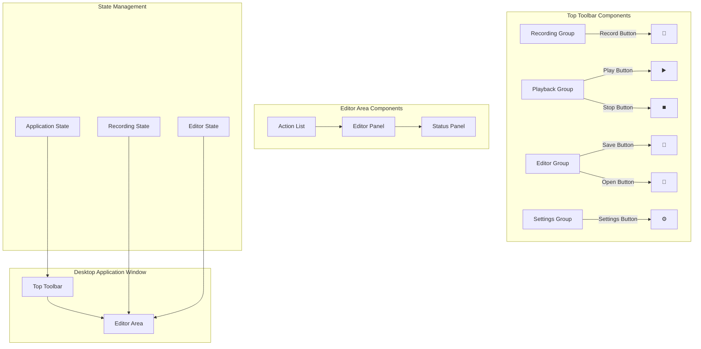

# Desktop UI Redesign - Design Document

## Overview

The Desktop UI Redesign transforms the GeniusQA Desktop application from a multi-screen interface with text-based buttons into a unified, toolbar-driven experience. This design eliminates the title section, combines recording controls with the script editor, and implements compact icon-based buttons with tooltips for maximum screen space efficiency.

The redesign prioritizes immediate functionality access, real-time feedback during recording, and seamless workflow transitions. By adopting modern desktop application patterns with context-aware toolbars and integrated editing capabilities, the interface reduces cognitive load while maintaining all existing functionality.

## Architecture

### High-Level Architecture



### Component Hierarchy

```
UnifiedInterface
├── TopToolbar
│   ├── RecordingGroup
│   │   ├── RecordButton (icon + tooltip)
│   │   └── RecordingIndicator
│   ├── PlaybackGroup
│   │   ├── PlayButton (icon + tooltip)
│   │   └── StopButton (icon + tooltip)
│   ├── EditorGroup
│   │   ├── SaveButton (icon + tooltip)
│   │   ├── OpenButton (icon + tooltip)
│   │   └── ClearButton (icon + tooltip)
│   └── SettingsGroup
│       └── SettingsButton (icon + tooltip)
└── EditorArea
    ├── ActionList
    │   ├── ActionItem[]
    │   └── RealTimeUpdates
    ├── EditorPanel
    │   ├── ScriptViewer
    │   └── ActionDetails
    └── StatusPanel
        ├── RecordingStatus
        ├── PlaybackStatus
        └── EditorStatus
```

## Components and Interfaces

### 1. UnifiedInterface Component

**Purpose**: Main container component that manages the overall layout and state coordination

**Interface**:
```typescript
interface UnifiedInterfaceProps {
  // No external props - self-contained
}

interface UnifiedInterfaceState {
  applicationMode: 'idle' | 'recording' | 'playing' | 'editing';
  currentScript: ScriptFile | null;
  recordingSession: RecordingSession | null;
  playbackSession: PlaybackSession | null;
  editorVisible: boolean;
  toolbarCollapsed: boolean;
}
```

**Responsibilities**:
- Coordinate state between toolbar and editor components
- Handle application-level keyboard shortcuts
- Manage window layout and responsive behavior
- Provide context for child components

### 2. TopToolbar Component

**Purpose**: Horizontal toolbar containing all action buttons with icons and tooltips

**Interface**:
```typescript
interface TopToolbarProps {
  applicationMode: ApplicationMode;
  hasRecordings: boolean;
  currentScript: ScriptFile | null;
  onRecordStart: () => void;
  onRecordStop: () => void;
  onPlayStart: () => void;
  onPlayStop: () => void;
  onSave: () => void;
  onOpen: () => void;
  onClear: () => void;
  onSettings: () => void;
}

interface ToolbarButtonProps {
  icon: IconType;
  tooltip: string;
  onClick: () => void;
  disabled?: boolean;
  active?: boolean;
  variant?: 'primary' | 'secondary' | 'danger';
}
```

**Design Specifications**:
- Height: 48px (optimal for touch and mouse interaction)
- Button size: 32x32px with 8px padding
- Button spacing: 4px between buttons, 16px between groups
- Background: Subtle gradient or solid color with 1px bottom border
- Icons: 16x16px, scalable SVG format
- Tooltips: Appear 500ms after hover, positioned below button

### 3. ToolbarButton Component

**Purpose**: Reusable button component with icon, tooltip, and state management

**Interface**:
```typescript
interface ToolbarButtonState {
  isHovered: boolean;
  isPressed: boolean;
  tooltipVisible: boolean;
}

interface TooltipProps {
  text: string;
  position: 'top' | 'bottom' | 'left' | 'right';
  delay: number;
  visible: boolean;
}
```

**Visual States**:
- **Default**: Icon with normal opacity (0.8), subtle background
- **Hover**: Icon with full opacity (1.0), highlighted background
- **Pressed**: Icon with pressed effect, darker background
- **Disabled**: Icon with reduced opacity (0.4), no hover effects
- **Active**: Icon with accent color, persistent highlight

### 4. EditorArea Component

**Purpose**: Integrated script editor that displays and allows modification of recorded actions

**Interface**:
```typescript
interface EditorAreaProps {
  script: ScriptFile | null;
  recordingSession: RecordingSession | null;
  visible: boolean;
  onScriptChange: (script: ScriptFile) => void;
  onActionSelect: (actionId: string) => void;
  onActionEdit: (actionId: string, changes: Partial<Action>) => void;
  onActionDelete: (actionId: string) => void;
}

interface EditorAreaState {
  selectedActionId: string | null;
  scrollPosition: number;
  filterText: string;
  viewMode: 'list' | 'timeline' | 'code';
}
```

**Layout Specifications**:
- Takes remaining vertical space below toolbar
- Minimum height: 200px
- Responsive layout with collapsible panels
- Scrollable content areas with custom scrollbars

### 5. ActionList Component

**Purpose**: Displays recorded actions in real-time during recording and allows editing

**Interface**:
```typescript
interface ActionListProps {
  actions: Action[];
  selectedActionId: string | null;
  recordingActive: boolean;
  onActionSelect: (actionId: string) => void;
  onActionEdit: (actionId: string, changes: Partial<Action>) => void;
  onActionDelete: (actionId: string) => void;
}

interface ActionItemProps {
  action: Action;
  selected: boolean;
  index: number;
  onSelect: () => void;
  onEdit: (changes: Partial<Action>) => void;
  onDelete: () => void;
}
```

**Real-time Updates**:
- New actions appear with subtle animation
- Auto-scroll to latest action during recording
- Visual indicators for action types (mouse, keyboard, delay)
- Timestamp display with relative timing

## Data Models

### Application State

```typescript
type ApplicationMode = 'idle' | 'recording' | 'playing' | 'editing';

interface ApplicationState {
  mode: ApplicationMode;
  currentScript: ScriptFile | null;
  recordingSession: RecordingSession | null;
  playbackSession: PlaybackSession | null;
  editorState: EditorState;
  uiState: UIState;
}

interface UIState {
  toolbarVisible: boolean;
  editorVisible: boolean;
  selectedActionId: string | null;
  tooltipState: TooltipState;
  windowDimensions: { width: number; height: number };
}

interface TooltipState {
  visible: boolean;
  text: string;
  position: { x: number; y: number };
  targetElement: string | null;
}
```

### Button Configuration

```typescript
interface ButtonConfig {
  id: string;
  icon: IconType;
  tooltip: string;
  group: 'recording' | 'playback' | 'editor' | 'settings';
  action: string;
  enabledWhen: (state: ApplicationState) => boolean;
  activeWhen?: (state: ApplicationState) => boolean;
  variant?: 'primary' | 'secondary' | 'danger';
}

const TOOLBAR_BUTTONS: ButtonConfig[] = [
  {
    id: 'record',
    icon: 'RecordIcon',
    tooltip: 'Start Recording (Ctrl+R)',
    group: 'recording',
    action: 'START_RECORDING',
    enabledWhen: (state) => state.mode === 'idle',
    variant: 'primary'
  },
  {
    id: 'play',
    icon: 'PlayIcon', 
    tooltip: 'Start Playback (Ctrl+P)',
    group: 'playback',
    action: 'START_PLAYBACK',
    enabledWhen: (state) => state.mode === 'idle' && state.currentScript !== null
  },
  {
    id: 'stop',
    icon: 'StopIcon',
    tooltip: 'Stop Current Action (Ctrl+S)',
    group: 'playback',
    action: 'STOP_ACTION',
    enabledWhen: (state) => state.mode === 'recording' || state.mode === 'playing',
    variant: 'danger'
  },
  // ... additional buttons
];
```

### Icon System

```typescript
interface IconProps {
  size?: number;
  color?: string;
  opacity?: number;
  className?: string;
}

// Icon components using SVG
const RecordIcon: React.FC<IconProps> = ({ size = 16, color = 'currentColor', ...props }) => (
  <svg width={size} height={size} viewBox="0 0 16 16" {...props}>
    <circle cx="8" cy="8" r="6" fill={color} />
  </svg>
);

const PlayIcon: React.FC<IconProps> = ({ size = 16, color = 'currentColor', ...props }) => (
  <svg width={size} height={size} viewBox="0 0 16 16" {...props}>
    <path d="M3 2l10 6-10 6V2z" fill={color} />
  </svg>
);

const StopIcon: React.FC<IconProps> = ({ size = 16, color = 'currentColor', ...props }) => (
  <svg width={size} height={size} viewBox="0 0 16 16" {...props}>
    <rect x="3" y="3" width="10" height="10" fill={color} />
  </svg>
);
```

## Visual Design System

### Color Palette

```css
:root {
  /* Primary Colors */
  --primary-bg: #ffffff;
  --secondary-bg: #f8f9fa;
  --toolbar-bg: #f1f3f4;
  
  /* Accent Colors */
  --accent-primary: #1976d2;
  --accent-success: #4caf50;
  --accent-warning: #ff9800;
  --accent-danger: #f44336;
  
  /* Text Colors */
  --text-primary: #212529;
  --text-secondary: #6c757d;
  --text-muted: #adb5bd;
  
  /* Border Colors */
  --border-light: #e9ecef;
  --border-medium: #dee2e6;
  --border-dark: #adb5bd;
  
  /* Button States */
  --button-hover: rgba(25, 118, 210, 0.08);
  --button-active: rgba(25, 118, 210, 0.12);
  --button-disabled: rgba(0, 0, 0, 0.04);
}
```

### Typography

```css
.toolbar-button-tooltip {
  font-family: -apple-system, BlinkMacSystemFont, 'Segoe UI', Roboto, sans-serif;
  font-size: 12px;
  font-weight: 500;
  line-height: 1.4;
  color: var(--text-primary);
}

.editor-text {
  font-family: 'SF Mono', Monaco, 'Cascadia Code', 'Roboto Mono', monospace;
  font-size: 13px;
  line-height: 1.5;
}
```

### Layout Specifications

```css
.unified-interface {
  display: flex;
  flex-direction: column;
  height: 100vh;
  background: var(--primary-bg);
}

.top-toolbar {
  height: 48px;
  background: var(--toolbar-bg);
  border-bottom: 1px solid var(--border-light);
  display: flex;
  align-items: center;
  padding: 0 16px;
  gap: 16px;
}

.toolbar-group {
  display: flex;
  gap: 4px;
  align-items: center;
}

.toolbar-button {
  width: 32px;
  height: 32px;
  border: none;
  border-radius: 4px;
  background: transparent;
  display: flex;
  align-items: center;
  justify-content: center;
  cursor: pointer;
  transition: all 0.15s ease;
  position: relative;
}

.toolbar-button:hover {
  background: var(--button-hover);
}

.toolbar-button:active {
  background: var(--button-active);
  transform: translateY(1px);
}

.toolbar-button:disabled {
  opacity: 0.4;
  cursor: not-allowed;
}

.editor-area {
  flex: 1;
  display: flex;
  flex-direction: column;
  overflow: hidden;
}
```

## Correctness Properties

*A property is a characteristic or behavior that should hold true across all valid executions of a system—essentially, a formal statement about what the system should do. Properties serve as the bridge between human-readable specifications and machine-verifiable correctness guarantees.*

### Property 1: Unified interface consistency
*For any* application state (idle, recording, playing, editing), the interface should always display both the toolbar and editor area in a single unified view without requiring navigation between screens.
**Validates: Requirements 1.1, 1.2, 1.3, 1.4, 1.5**

### Property 2: Title section absence
*For any* rendering of the Desktop App, the interface should never display the "GeniusQA Recorder" title text or "Record and replay desktop interactions" subtitle text.
**Validates: Requirements 2.1, 2.2, 2.4, 2.5**

### Property 3: Button icon-only display
*For any* action button in the toolbar, the button should display only an icon without text labels, and hovering should reveal a descriptive tooltip.
**Validates: Requirements 3.1, 3.2, 3.5**

### Property 4: Toolbar positioning consistency
*For any* window configuration, the toolbar should always be positioned at the top of the application window, immediately below the window frame, containing all action buttons in logical groups.
**Validates: Requirements 4.1, 4.2, 4.3, 4.4, 4.5**

### Property 5: Immediate editor visibility during recording
*For any* recording session initiation, the editor interface should become visible immediately when recording starts and display captured actions in real-time.
**Validates: Requirements 5.1, 5.2, 5.3, 5.4, 5.5**

### Property 6: Seamless integration preservation
*For any* mode transition (idle ↔ recording ↔ playing ↔ editing), the toolbar and editor should remain visible and accessible without layout changes or screen switching.
**Validates: Requirements 6.1, 6.2, 6.3, 6.4, 6.5**

### Property 7: Icon recognition and consistency
*For any* action button, the icon should be universally recognizable for its function and maintain consistent visual style, sizing, and color scheme across all buttons.
**Validates: Requirements 7.1, 7.2, 7.3, 7.4, 7.5**

### Property 8: Visual hierarchy maintenance
*For any* interface rendering, the toolbar should be visually distinct from the editor area while maintaining appropriate visual hierarchy and not overwhelming the interface.
**Validates: Requirements 8.1, 8.2, 8.3, 8.4, 8.5**

### Property 9: Responsive interaction feedback
*For any* user interaction with toolbar buttons, the system should provide visual feedback within specified time limits (hover: 50ms, click: immediate, state changes: 100ms, tooltips: 500ms).
**Validates: Requirements 9.1, 9.2, 9.3, 9.4, 9.5**

### Property 10: Functionality preservation
*For any* action available in the previous design, the unified interface should provide equivalent functionality with the same underlying behavior and data handling.
**Validates: Requirements 10.1, 10.2, 10.3, 10.4, 10.5**

### Property 11: Toolbar button state consistency
*For any* application state, button enabled/disabled states should match the original functionality: Record enabled when idle, Play enabled when idle with scripts, Stop enabled when recording or playing.
**Validates: Preserves existing desktop-recorder-mvp functionality**

### Property 12: Real-time action display
*For any* recording session, new actions should appear in the editor with subtle animation and auto-scroll to the latest action, maintaining real-time feedback.
**Validates: Requirements 5.1, 5.2, 5.5**

## Error Handling

### Error Categories

**1. UI State Errors**
- Invalid application mode transitions
- Button state inconsistencies
- Toolbar rendering failures
- Editor display errors

**2. Integration Errors**
- Toolbar-editor communication failures
- State synchronization issues
- Component mounting/unmounting errors
- Event handler failures

**3. Layout Errors**
- Responsive layout failures
- Toolbar positioning issues
- Editor area sizing problems
- Window resize handling errors

**4. Interaction Errors**
- Button click handling failures
- Tooltip display issues
- Keyboard shortcut conflicts
- Focus management problems

### Error Handling Strategy

**Component Level:**
- Implement error boundaries for each major component
- Graceful degradation when non-critical features fail
- Clear error states with user-friendly messages
- Automatic recovery attempts where possible

**State Management:**
- Validate state transitions before applying
- Rollback to previous valid state on errors
- Log state changes for debugging
- Prevent invalid state combinations

**UI Feedback:**
- Show loading states during operations
- Display error messages in appropriate locations
- Provide retry mechanisms for recoverable errors
- Maintain interface responsiveness during errors

**Error Message Examples:**
```
"Interface layout error: Please restart the application."
"Button state error: Recording controls temporarily unavailable."
"Editor display error: Script content may not be visible."
"Toolbar error: Some buttons may not respond. Try refreshing."
```

## Testing Strategy

### Unit Testing

**React Components:**
- UnifiedInterface state management and layout
- TopToolbar button rendering and state logic
- ToolbarButton interaction and tooltip behavior
- EditorArea integration and display logic
- ActionList real-time updates and scrolling

**Component Integration:**
- Toolbar-editor communication
- State synchronization between components
- Event propagation and handling
- Layout responsiveness

### Property-Based Testing

We will use **fast-check** for TypeScript property-based testing. Each property-based test should run a minimum of 100 iterations.

**Property Test Requirements:**
- Each test must include a comment referencing the design property
- Format: `// Feature: desktop-ui-redesign, Property X: [property text]`
- Tests should generate random but valid inputs
- Tests should verify the universal property holds across all inputs

**Example Property Tests:**

```typescript
// Feature: desktop-ui-redesign, Property 1: Unified interface consistency
test('interface always shows toolbar and editor in unified view', () => {
  fc.assert(
    fc.property(
      fc.constantFrom('idle', 'recording', 'playing', 'editing'),
      fc.boolean(), // hasScript
      (mode, hasScript) => {
        const component = render(<UnifiedInterface />);
        // Set application mode
        act(() => setApplicationMode(mode, hasScript));
        
        // Verify both toolbar and editor are visible
        expect(screen.getByTestId('top-toolbar')).toBeVisible();
        expect(screen.getByTestId('editor-area')).toBeVisible();
        // Verify no navigation elements present
        expect(screen.queryByTestId('navigation')).toBeNull();
      }
    ),
    { numRuns: 100 }
  );
});

// Feature: desktop-ui-redesign, Property 3: Button icon-only display
test('all toolbar buttons display only icons with tooltips', () => {
  fc.assert(
    fc.property(
      fc.array(fc.record({
        id: fc.string(),
        icon: fc.string(),
        tooltip: fc.string(),
        enabled: fc.boolean()
      })),
      (buttonConfigs) => {
        const component = render(<TopToolbar buttons={buttonConfigs} />);
        
        buttonConfigs.forEach(config => {
          const button = screen.getByTestId(`button-${config.id}`);
          // Should have icon but no text
          expect(button.querySelector('svg')).toBeTruthy();
          expect(button.textContent).toBe('');
          
          // Should show tooltip on hover
          fireEvent.mouseEnter(button);
          expect(screen.getByText(config.tooltip)).toBeVisible();
        });
      }
    ),
    { numRuns: 100 }
  );
});

// Feature: desktop-ui-redesign, Property 9: Responsive interaction feedback
test('button interactions provide timely visual feedback', () => {
  fc.assert(
    fc.property(
      fc.constantFrom('record', 'play', 'stop', 'save'),
      (buttonType) => {
        const startTime = performance.now();
        const component = render(<ToolbarButton type={buttonType} />);
        const button = screen.getByTestId(`button-${buttonType}`);
        
        // Test hover feedback timing
        fireEvent.mouseEnter(button);
        const hoverTime = performance.now() - startTime;
        expect(hoverTime).toBeLessThan(50); // 50ms requirement
        
        // Test click feedback
        fireEvent.mouseDown(button);
        expect(button).toHaveClass('pressed');
        
        fireEvent.mouseUp(button);
        expect(button).not.toHaveClass('pressed');
      }
    ),
    { numRuns: 100 }
  );
});
```

### Integration Testing

- End-to-end workflow testing (record → edit → play)
- Cross-component state synchronization
- Keyboard shortcut integration
- Window resize and responsive behavior
- Error recovery and graceful degradation

### Visual Testing

- Screenshot comparison testing for layout consistency
- Icon rendering and sizing verification
- Tooltip positioning and appearance
- Button state visual feedback
- Color scheme and theme compliance

### Accessibility Testing

- Keyboard navigation through toolbar
- Screen reader compatibility
- Focus management and indicators
- Color contrast compliance
- ARIA labels and descriptions

## Implementation Notes

### Development Approach

**Phase 1: Core Layout**
- Implement UnifiedInterface container component
- Create TopToolbar with basic button layout
- Establish EditorArea placeholder
- Set up component communication patterns

**Phase 2: Button System**
- Implement ToolbarButton with icon and tooltip support
- Create button configuration system
- Add state management for button enabled/disabled states
- Implement visual feedback and animations

**Phase 3: Editor Integration**
- Integrate existing editor functionality into EditorArea
- Implement real-time action display during recording
- Add auto-scroll and animation for new actions
- Ensure seamless state transitions

**Phase 4: Polish and Testing**
- Refine visual design and animations
- Implement comprehensive error handling
- Add accessibility features
- Conduct cross-platform testing

### Technical Considerations

**State Management:**
- Use React Context for application-wide state
- Implement useReducer for complex state transitions
- Maintain backward compatibility with existing state structure
- Add state validation and error recovery

**Performance:**
- Optimize re-renders with React.memo and useMemo
- Implement virtual scrolling for large action lists
- Debounce rapid state changes
- Use CSS transforms for smooth animations

**Responsive Design:**
- Implement flexible toolbar layout for different window sizes
- Ensure minimum usable dimensions
- Handle window resize events gracefully
- Maintain button accessibility at all sizes

**Cross-Platform Compatibility:**
- Test icon rendering across different operating systems
- Verify tooltip behavior on touch devices
- Ensure keyboard shortcuts work consistently
- Handle platform-specific styling differences

### Migration Strategy

**Backward Compatibility:**
- Preserve all existing API interfaces
- Maintain current data structures and file formats
- Keep existing keyboard shortcuts and behaviors
- Ensure smooth upgrade path for users

**Gradual Rollout:**
- Implement feature flags for new interface
- Allow users to switch between old and new interfaces
- Gather user feedback during transition period
- Monitor performance and error metrics

**Data Migration:**
- No data migration required (UI-only changes)
- Preserve existing script files and settings
- Maintain compatibility with existing workflows
- Ensure no data loss during interface transition

## Success Metrics

### Usability Metrics
- Reduced clicks to access functionality (target: 50% reduction)
- Faster task completion times (target: 30% improvement)
- Increased user satisfaction scores (target: 4.5/5.0)
- Reduced learning curve for new users (target: 25% faster onboarding)

### Technical Metrics
- Interface responsiveness (target: <100ms for all interactions)
- Error rate reduction (target: 90% fewer UI-related errors)
- Cross-platform consistency (target: 100% feature parity)
- Accessibility compliance (target: WCAG 2.1 AA standard)

### Performance Metrics
- Application startup time (maintain current performance)
- Memory usage (no increase from current baseline)
- CPU usage during recording (maintain current efficiency)
- Battery life impact (no degradation on mobile devices)

### User Adoption Metrics
- Interface preference (target: 80% prefer new interface)
- Feature discovery rate (target: 90% find all features within first session)
- Support ticket reduction (target: 50% fewer UI-related issues)
- User retention (maintain or improve current rates)
