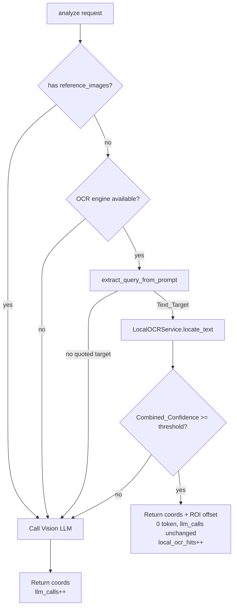

# Design Document: Local OCR Token Optimization

## Overview

Thêm một bước OCR cục bộ (Tesseract) làm fast-path trước khi gọi Vision LLM
trong `AIVisionService.analyze()`. Mục tiêu: 0 token cho các text target, hoạt
động offline, và degrade gracefully khi không có OCR engine.

## Architecture

## Components

### `LocalOCRService` (`python-core/src/vision/local_ocr_service.py`)

- `is_available() -> bool`: True chỉ khi `pytesseract` import được VÀ
  `get_tesseract_version()` chạy được.
- `extract_text_boxes(screenshot, lang=None) -> List[OCRMatch]`: chạy
  `image_to_data` (Output.DICT), bỏ box rỗng/`conf < 0`, trả tâm box + confidence
  chuẩn hóa [0..1].
- `locate_text(screenshot, query, lang=None) -> LocalOCRResult`: chọn box có
  `Match_Score × OCR_confidence` cao nhất; success chỉ khi ≥ `min_confidence`
  (mặc định 0.5).
- `extract_query_from_prompt(prompt) -> Optional[str]` (staticmethod): trích cụm
  trong ngoặc; None nếu không có.
- Helpers thuần: `normalize_text`, `text_match_score` (exact 1.0 / whole-word 0.9
  / substring 0.75 / 0.0).

### Tích hợp vào `AIVisionService`

- `__init__(local_ocr=None, enable_local_ocr=True)`: inject được để test.
- `analyze()`: sau khi crop ROI, gọi `_try_local_ocr(...)`; nếu trả response thì
  `local_ocr_hits++` và return; ngược lại tiếp tục nhánh LLM với `llm_calls++`.
- `_try_local_ocr(...) -> Optional[AIVisionResponse]`: kiểm tra availability →
  trích query → `locate_text` → cộng ROI offset; mọi exception → None (Fallback).
- `set_local_ocr_enabled(bool)`.

## Correctness Properties (validated by tests)

- **Property 1 — Local hit skips LLM**: hit cục bộ ⇒ `llm_calls == 0`,
  `local_ocr_hits == 1`. *(Req 1.2, 6.1)*
- **Property 2 — Miss falls back**: OCR miss ⇒ LLM được gọi, `llm_calls == 1`.
  *(Req 1.3, 6.2)*
- **Property 3 — Reference images bypass OCR**: có reference_images ⇒
  `locate_text` không được gọi. *(Req 1.4)*
- **Property 4 — Disabled ⇒ always LLM**: `set_local_ocr_enabled(False)` ⇒ luôn
  LLM. *(Req 6.3)*
- **Property 5 — ROI offset applied**: hit cục bộ trong ROI ⇒ tọa độ + offset.
  *(Req 4.1)*
- **Property 6 — Graceful degradation**: engine vắng ⇒ `is_available()==False`,
  `analyze()` dùng LLM, không raise. *(Req 5)*
- **Property 7 — Conservative match tiers**: exact/word/substring/none mapping
  đúng; không fuzzy. *(Req 3)*
- **Property 8 — Unicode target**: trích & khớp "Đăng nhập". *(Req 2.3)*

## Error Handling

- Thiếu engine / lỗi decode / lỗi `image_to_data` → trả `[]` hoặc
  `LocalOCRResult(success=False)` → Fallback LLM. Không bao giờ raise ra ngoài
  `analyze()`.

## Token Cost Model

| Trường hợp | LLM call | Token |
|---|---|---|
| Text target, OCR hit | 0 | 0 |
| Text target, OCR miss | 1 | có |
| Có reference_images | 1 | có |
| OCR engine vắng | 1 | có |

## Dependencies

- `pytesseract` (optional, đã thêm vào `requirements.txt`).
- Binary `tesseract` (macOS: `brew install tesseract`).
