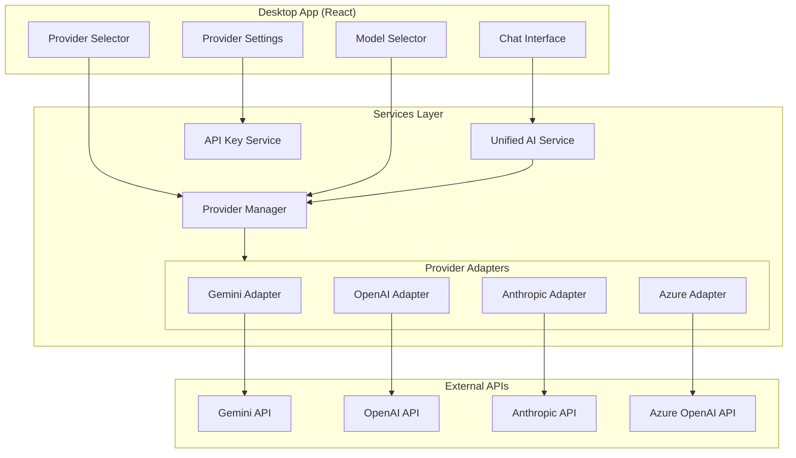

# Design Document: Multi-Provider AI

## Overview

Multi-Provider AI mở rộng AI Script Builder để hỗ trợ nhiều AI provider (Gemini, OpenAI, Anthropic, Azure OpenAI). Hệ thống sử dụng Adapter Pattern để tạo một interface thống nhất cho tất cả providers, cho phép dễ dàng thêm provider mới và đảm bảo output luôn tương thích với rust-core format.

### Key Features
- Hỗ trợ nhiều AI providers với unified interface
- Quản lý API keys riêng biệt cho từng provider
- Chọn provider và model linh hoạt
- Xử lý lỗi thông minh với fallback suggestions
- Provider status tracking và usage statistics

## Architecture



## Components and Interfaces

### 1. Provider Adapter Interface

```typescript
/**
 * Base interface that all provider adapters must implement
 */
interface AIProviderAdapter {
  // Provider identification
  readonly providerId: AIProvider;
  readonly providerName: string;
  
  // Initialization
  initialize(apiKey: string): Promise<void>;
  isInitialized(): boolean;
  reset(): void;
  
  // Model management
  getAvailableModels(): ProviderModel[];
  getDefaultModel(): string;
  setModel(modelId: string): void;
  getCurrentModel(): string;
  
  // Script generation
  generateScript(
    prompt: string,
    context: ConversationContext
  ): Promise<ProviderResponse>;
  
  // Refinement
  refineScript(
    currentScript: ScriptData,
    feedback: string
  ): Promise<ProviderResponse>;
}

/**
 * Standardized response from any provider
 */
interface ProviderResponse {
  success: boolean;
  script?: ScriptData;
  message: string;
  rawResponse?: string;
  needsClarification?: boolean;
  clarificationQuestions?: string[];
  metadata: ResponseMetadata;
}

interface ResponseMetadata {
  providerId: AIProvider;
  modelId: string;
  processingTimeMs: number;
  tokenUsage?: {
    promptTokens: number;
    completionTokens: number;
    totalTokens: number;
  };
}
```

### 2. Provider Manager

```typescript
interface ProviderManager {
  // Provider registration
  registerAdapter(adapter: AIProviderAdapter): void;
  getAdapter(providerId: AIProvider): AIProviderAdapter | null;
  
  // Active provider management
  setActiveProvider(providerId: AIProvider): void;
  getActiveProvider(): AIProvider | null;
  getActiveAdapter(): AIProviderAdapter | null;
  
  // Configuration status
  getConfiguredProviders(): AIProvider[];
  getProviderStatus(providerId: AIProvider): ProviderStatus;
  getAllProviderStatuses(): Map<AIProvider, ProviderStatus>;
  
  // Model management
  setActiveModel(modelId: string): void;
  getActiveModel(): string | null;
  
  // Statistics
  getSessionStats(): SessionStatistics;
  incrementRequestCount(providerId: AIProvider): void;
}

interface ProviderStatus {
  providerId: AIProvider;
  configured: boolean;
  active: boolean;
  lastError?: ProviderError;
  requestCount: number;
}

interface SessionStatistics {
  totalRequests: number;
  requestsByProvider: Map<AIProvider, number>;
  successRate: number;
  averageResponseTime: number;
}
```

### 3. Unified AI Service

```typescript
interface UnifiedAIService {
  // Initialization
  initialize(userId: string): Promise<void>;
  
  // Provider selection
  selectProvider(providerId: AIProvider): Promise<void>;
  selectModel(modelId: string): void;
  
  // Script generation (delegates to active provider)
  generateScript(
    prompt: string,
    context: ConversationContext
  ): Promise<GenerationResult>;
  
  refineScript(
    currentScript: ScriptData,
    feedback: string
  ): Promise<GenerationResult>;
  
  // Status
  getActiveProvider(): AIProvider | null;
  getActiveModel(): string | null;
  getAvailableProviders(): ProviderInfo[];
  getAvailableModels(): ProviderModel[];
}

interface ProviderInfo {
  id: AIProvider;
  name: string;
  description: string;
  configured: boolean;
  status: 'ready' | 'error' | 'unconfigured';
  models: ProviderModel[];
}

interface ProviderModel {
  id: string;
  name: string;
  description: string;
  capabilities: string[];
  pricingTier: 'free' | 'standard' | 'premium';
  isDefault: boolean;
}
```

### 4. Extended API Key Service

```typescript
// Extends existing ApiKeyService to support multiple providers
interface MultiProviderApiKeyService {
  // Store/retrieve per provider
  storeApiKey(userId: string, provider: AIProvider, apiKey: string): Promise<void>;
  getApiKey(userId: string, provider: AIProvider): Promise<string | null>;
  hasApiKey(userId: string, provider: AIProvider): Promise<boolean>;
  deleteApiKey(userId: string, provider: AIProvider): Promise<void>;
  
  // Bulk operations
  getConfiguredProviders(userId: string): Promise<AIProvider[]>;
  deleteAllApiKeys(userId: string): Promise<void>;
}
```

### 5. Provider Selector Component

```typescript
interface ProviderSelectorProps {
  providers: ProviderInfo[];
  activeProvider: AIProvider | null;
  onProviderSelect: (providerId: AIProvider) => void;
  onConfigureProvider: (providerId: AIProvider) => void;
}

interface ModelSelectorProps {
  models: ProviderModel[];
  activeModel: string | null;
  onModelSelect: (modelId: string) => void;
}
```

## Data Models

### Provider Types

```typescript
type AIProvider = 'gemini' | 'openai' | 'anthropic' | 'azure';

const PROVIDER_CONFIGS: Record<AIProvider, ProviderConfig> = {
  gemini: {
    id: 'gemini',
    name: 'Google Gemini',
    description: 'Google AI Studio API',
    apiBaseUrl: 'https://generativelanguage.googleapis.com/v1beta',
    models: [
      { id: 'gemini-2.0-flash', name: 'Gemini 2.0 Flash', isDefault: true },
      { id: 'gemini-1.5-pro', name: 'Gemini 1.5 Pro', isDefault: false },
    ],
  },
  openai: {
    id: 'openai',
    name: 'OpenAI',
    description: 'GPT-4, GPT-3.5, etc.',
    apiBaseUrl: 'https://api.openai.com/v1',
    models: [
      { id: 'gpt-4o', name: 'GPT-4o', isDefault: true },
      { id: 'gpt-4o-mini', name: 'GPT-4o Mini', isDefault: false },
      { id: 'gpt-4-turbo', name: 'GPT-4 Turbo', isDefault: false },
    ],
  },
  anthropic: {
    id: 'anthropic',
    name: 'Anthropic',
    description: 'Claude AI',
    apiBaseUrl: 'https://api.anthropic.com/v1',
    models: [
      { id: 'claude-3-5-sonnet-20241022', name: 'Claude 3.5 Sonnet', isDefault: true },
      { id: 'claude-3-5-haiku-20241022', name: 'Claude 3.5 Haiku', isDefault: false },
    ],
  },
  azure: {
    id: 'azure',
    name: 'Azure OpenAI',
    description: 'Microsoft Azure OpenAI Service',
    apiBaseUrl: '', // User-configured endpoint
    models: [], // User-configured deployments
  },
};
```

### Provider Error Types

```typescript
interface ProviderError {
  type: ProviderErrorType;
  message: string;
  providerId: AIProvider;
  timestamp: Date;
  retryable: boolean;
  suggestAlternative: boolean;
}

type ProviderErrorType =
  | 'rate_limit'
  | 'network_error'
  | 'auth_error'
  | 'invalid_response'
  | 'content_filtered'
  | 'quota_exceeded'
  | 'unknown';
```

### User Preferences

```typescript
interface UserProviderPreferences {
  defaultProvider: AIProvider | null;
  modelPreferences: Record<AIProvider, string>; // provider -> preferred model
  lastUsedProvider: AIProvider | null;
}
```

## Correctness Properties

*A property is a characteristic or behavior that should hold true across all valid executions of a system-essentially, a formal statement about what the system should do. Properties serve as the bridge between human-readable specifications and machine-verifiable correctness guarantees.*

### Property 1: Multi-Provider API Key Storage Round-Trip

*For any* valid API key, user ID, and provider combination, storing the key and then retrieving it with the same provider identifier should return the original key value.

**Validates: Requirements 1.2**

### Property 2: Configured Providers Accuracy

*For any* set of stored API keys for different providers, querying configured providers should return exactly the providers that have keys stored.

**Validates: Requirements 1.3, 1.4**

### Property 3: Provider Selector Shows Configured Providers

*For any* set of configured providers, the provider selector should display exactly those providers as available options.

**Validates: Requirements 2.1**

### Property 4: Provider Selection Updates Active Provider

*For any* configured provider, selecting it should result in that provider becoming the active provider for script generation.

**Validates: Requirements 2.2**

### Property 5: Single Provider Auto-Selection

*For any* user with exactly one configured provider, that provider should be automatically selected as active.

**Validates: Requirements 2.3**

### Property 6: Conversation History Preservation on Provider Switch

*For any* conversation history and provider switch operation, the conversation history should remain unchanged after the switch.

**Validates: Requirements 2.4**

### Property 7: Model List Per Provider

*For any* provider, selecting it should display exactly the models defined for that provider in the configuration.

**Validates: Requirements 3.1**

### Property 8: Model Selection Affects Generation

*For any* selected model, script generation requests should use that model in the API call.

**Validates: Requirements 3.2**

### Property 9: Default Model Pre-Selection

*For any* provider with a defined default model, that model should be pre-selected when the provider is chosen.

**Validates: Requirements 3.3**

### Property 10: Model Preference Persistence

*For any* model selection, the selection should persist across sessions for the same provider.

**Validates: Requirements 3.5**

### Property 11: Error Logging Completeness

*For any* provider error, the logged error should contain the provider name and error type.

**Validates: Requirements 4.4**

### Property 12: Alternative Provider Suggestion on Failure

*For any* provider failure when multiple providers are configured, the system should offer at least one alternative provider.

**Validates: Requirements 4.5**

### Property 13: Unified Output Format

*For any* provider generating a script, the output should be valid rust-core compatible format with all required fields.

**Validates: Requirements 5.2**

### Property 14: Unified Prompt Structure

*For any* provider receiving a prompt, the prompt should contain the complete list of available action types and their parameters.

**Validates: Requirements 5.3**

### Property 15: Unified Response Parsing

*For any* valid response from any provider, parsing should produce a valid ScriptData object or appropriate error.

**Validates: Requirements 5.4**

### Property 16: Provider Status Accuracy

*For any* provider, its status should accurately reflect whether it is configured, active, or has errors.

**Validates: Requirements 6.1**

### Property 17: Response Attribution

*For any* generated response, it should include the provider ID and model ID that generated it.

**Validates: Requirements 6.3**

### Property 18: Request Count Accuracy

*For any* sequence of requests to various providers, the usage statistics should accurately count requests per provider.

**Validates: Requirements 6.4**

## Error Handling

### Provider-Specific Errors

| Error Type | Handling |
|------------|----------|
| Rate Limit | Display wait time, offer to switch provider |
| Network Error | Retry with exponential backoff, suggest alternative |
| Auth Error | Prompt for API key update |
| Invalid Response | Retry with simplified prompt |
| Content Filtered | Inform user, suggest rephrasing |
| Quota Exceeded | Display quota info, suggest alternative provider |

### Fallback Strategy

```typescript
async function handleProviderFailure(
  error: ProviderError,
  configuredProviders: AIProvider[]
): Promise<FallbackAction> {
  if (!error.suggestAlternative || configuredProviders.length <= 1) {
    return { action: 'show_error', error };
  }
  
  const alternatives = configuredProviders.filter(
    p => p !== error.providerId
  );
  
  return {
    action: 'suggest_alternative',
    alternatives,
    originalError: error,
  };
}
```

## Testing Strategy

### Unit Testing

Unit tests sẽ được viết cho:

1. **Provider Adapters**: Test API call construction, response parsing
2. **Provider Manager**: Test provider registration, selection, status tracking
3. **Unified AI Service**: Test delegation, error handling
4. **API Key Service**: Test multi-provider storage/retrieval

### Property-Based Testing

Sử dụng **fast-check** library cho TypeScript property-based testing.

Mỗi property test sẽ:
- Chạy tối thiểu 100 iterations
- Được annotate với reference đến correctness property
- Test các invariants trên random inputs

```typescript
// Example property test annotation
/**
 * **Feature: multi-provider-ai, Property 1: Multi-Provider API Key Storage Round-Trip**
 * **Validates: Requirements 1.2**
 */
test('multi-provider API key storage round-trip', () => {
  fc.assert(
    fc.property(
      fc.string({ minLength: 10, maxLength: 100 }),
      fc.constantFrom('gemini', 'openai', 'anthropic', 'azure'),
      async (apiKey, provider) => {
        await apiKeyService.storeApiKey(userId, provider, apiKey);
        const retrieved = await apiKeyService.getApiKey(userId, provider);
        expect(retrieved).toBe(apiKey);
      }
    ),
    { numRuns: 100 }
  );
});
```

### Integration Testing

1. **Provider switching flow**: Select provider → Generate script → Switch → Verify history preserved
2. **Multi-provider configuration**: Configure multiple providers → Verify all accessible
3. **Fallback flow**: Simulate failure → Verify alternative suggestion → Switch → Generate

