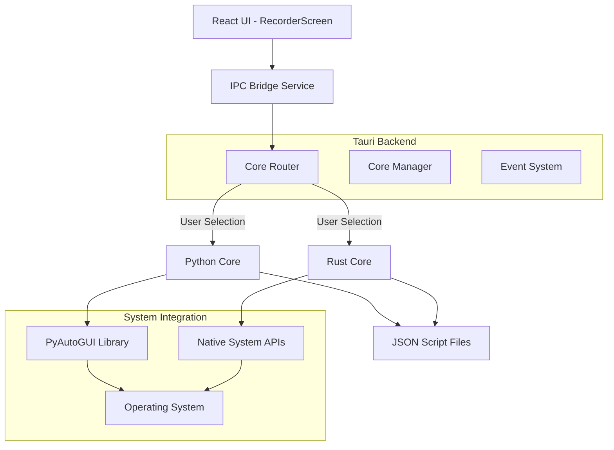
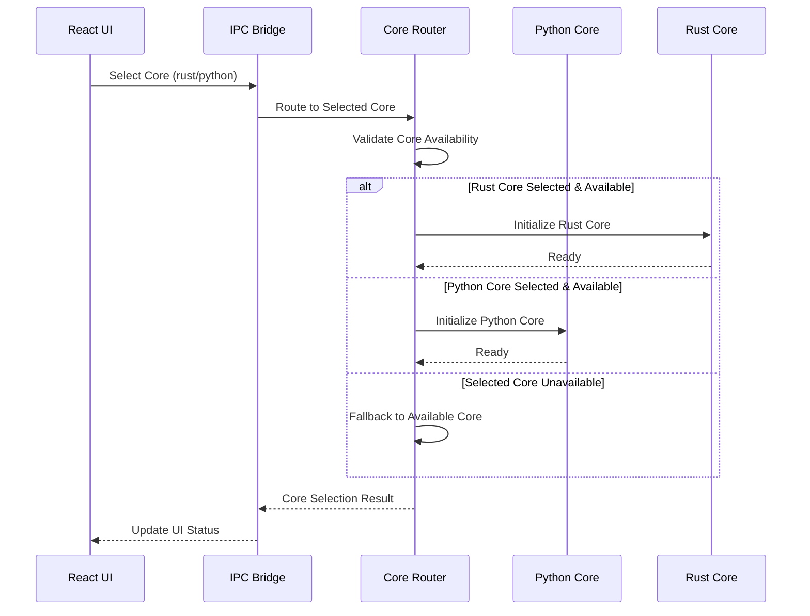

# Design Document

## Overview

The Rust Automation Core feature adds a high-performance, memory-safe alternative to the existing Python-based automation backend in GeniusQA Desktop. This design implements a dual-core architecture where users can choose between Python and Rust automation backends based on their performance, compatibility, and dependency preferences.

The Rust core leverages native system APIs and modern Rust libraries to provide equivalent functionality to the Python core while offering improved performance, reduced memory usage, and elimination of Python runtime dependencies. The design maintains full compatibility with existing Script Files and UI interfaces through a unified IPC command routing system.

## Architecture

### High-Level Architecture



### Core Selection Flow



## Components and Interfaces

### 1. Core Router Component

**Location**: `packages/desktop/src-tauri/src/core_router.rs`

The Core Router manages the selection and routing of automation commands to the appropriate backend.

```rust
pub struct CoreRouter {
    active_core: CoreType,
    python_core: Option<PythonCore>,
    rust_core: Option<RustCore>,
    config: CoreConfig,
}

pub enum CoreType {
    Python,
    Rust,
}

impl CoreRouter {
    pub fn new() -> Self;
    pub fn select_core(&mut self, core_type: CoreType) -> Result<(), CoreError>;
    pub fn get_available_cores() -> Vec<CoreType>;
    pub fn route_command(&self, command: AutomationCommand) -> Result<CommandResult, CoreError>;
}
```

### 2. Rust Automation Core

**Location**: `packages/rust-core/src/lib.rs`

The main Rust automation library implementing the core automation functionality.

```rust
pub struct RustAutomationCore {
    recorder: Option<Recorder>,
    player: Option<Player>,
    config: AutomationConfig,
}

pub trait AutomationCore {
    fn start_recording(&mut self) -> Result<(), AutomationError>;
    fn stop_recording(&mut self) -> Result<RecordingResult, AutomationError>;
    fn start_playback(&mut self, script_path: Option<String>, speed: f64, loops: u32) -> Result<(), AutomationError>;
    fn stop_playback(&mut self) -> Result<(), AutomationError>;
    fn pause_playback(&mut self) -> Result<bool, AutomationError>;
}
```

### 3. Platform-Specific Automation

**Windows Implementation**: `packages/rust-core/src/platform/windows.rs`
```rust
use winapi::um::winuser::{SendInput, INPUT, INPUT_MOUSE, INPUT_KEYBOARD};

pub struct WindowsAutomation {
    // Windows-specific automation using WinAPI
}
```

**macOS Implementation**: `packages/rust-core/src/platform/macos.rs`
```rust
use core_graphics::event::{CGEvent, CGEventType};

pub struct MacOSAutomation {
    // macOS-specific automation using Core Graphics
}
```

**Linux Implementation**: `packages/rust-core/src/platform/linux.rs`
```rust
use x11::xlib::{XOpenDisplay, XSendEvent};

pub struct LinuxAutomation {
    // Linux-specific automation using X11/Wayland
}
```

### 4. Enhanced IPC Bridge Service

**Location**: `packages/desktop/src/services/ipcBridgeService.ts`

Extended to support core selection and routing:

```typescript
export class IPCBridgeService {
    // Existing methods...
    
    public async selectCore(coreType: 'python' | 'rust'): Promise<void>;
    public async getAvailableCores(): Promise<string[]>;
    public async getCoreStatus(): Promise<CoreStatus>;
    public async getCorePerformanceMetrics(): Promise<PerformanceMetrics>;
}

interface CoreStatus {
    activeCoreType: 'python' | 'rust';
    availableCores: string[];
    coreHealth: {
        python?: boolean;
        rust?: boolean;
    };
}
```

### 5. Core Selection UI Component

**Location**: `packages/desktop/src/components/CoreSelector.tsx`

New component for core selection interface:

```typescript
interface CoreSelectorProps {
    currentCore: 'python' | 'rust';
    availableCores: string[];
    onCoreChange: (core: 'python' | 'rust') => void;
    performanceMetrics?: PerformanceMetrics;
}

export const CoreSelector: React.FC<CoreSelectorProps>;
```

## Data Models

### Core Configuration

```typescript
interface CoreConfig {
    preferredCore: 'python' | 'rust';
    fallbackEnabled: boolean;
    performanceTracking: boolean;
    autoDetection: boolean;
}
```

### Performance Metrics

```typescript
interface PerformanceMetrics {
    coreType: 'python' | 'rust';
    lastOperationTime: number;
    memoryUsage: number;
    cpuUsage: number;
    operationCount: number;
    errorRate: number;
}
```

### Automation Command

```rust
#[derive(Serialize, Deserialize)]
pub enum AutomationCommand {
    StartRecording,
    StopRecording,
    StartPlayback {
        script_path: Option<String>,
        speed: f64,
        loops: u32,
    },
    StopPlayback,
    PausePlayback,
    CheckRecordings,
    GetLatestRecording,
    ListScripts,
    LoadScript { path: String },
    SaveScript { path: String, data: ScriptData },
    DeleteScript { path: String },
}
```

### Script Compatibility

Both cores will use the same JSON schema for Script Files:

```json
{
  "version": "1.0",
  "metadata": {
    "created_at": "2024-01-01T12:00:00Z",
    "duration": 10.5,
    "action_count": 25,
    "core_type": "rust",
    "platform": "windows"
  },
  "actions": [
    {
      "type": "mouse_move",
      "x": 100,
      "y": 200,
      "timestamp": 0.0
    },
    {
      "type": "mouse_click",
      "x": 100,
      "y": 200,
      "button": "left",
      "timestamp": 0.5
    }
  ]
}
```

## Correctness Properties

*A property is a characteristic or behavior that should hold true across all valid executions of a system-essentially, a formal statement about what the system should do. Properties serve as the bridge between human-readable specifications and machine-verifiable correctness guarantees.*

Property 1: Core preference persistence
*For any* core selection made by the user, the system should persist this preference and use it consistently for all subsequent automation operations until changed
**Validates: Requirements 1.2**

Property 2: Core validation before switching
*For any* core switching attempt, the system should validate that the target core is available and functional before completing the switch
**Validates: Requirements 1.3**

Property 3: Fallback behavior on core unavailability
*For any* situation where the selected core becomes unavailable, the system should display an error message and fall back to the previously working core
**Validates: Requirements 1.4**

Property 4: Process restart on core change
*For any* core selection change during active automation processes, the system should restart those processes using the newly selected core
**Validates: Requirements 1.5**

Property 5: Rust core recording functionality
*For any* recording session using Rust core, the system should capture all mouse movements, clicks, and keyboard inputs using native Rust libraries
**Validates: Requirements 2.1**

Property 6: JSON format compatibility between cores
*For any* recording session, both Python and Rust cores should generate Script Files with identical JSON schema and structure
**Validates: Requirements 2.2, 7.3**

Property 7: Accurate timestamps and metadata
*For any* recording session with Rust core, stopping the recording should save all captured actions with accurate timestamps and complete metadata
**Validates: Requirements 2.3**

Property 8: Real-time feedback during recording
*For any* recording session with Rust core, the system should provide continuous real-time feedback and status updates to the Desktop App
**Validates: Requirements 2.4**

Property 9: Graceful error handling during recording
*For any* recording error with Rust core, the system should handle it gracefully and provide clear, actionable error messages
**Validates: Requirements 2.5**

Property 10: Timing accuracy equivalence
*For any* Script File, playback timing accuracy should be equivalent between Python and Rust cores within acceptable tolerance
**Validates: Requirements 3.1**

Property 11: Feature parity for playback
*For any* playback operation with Rust core, all features (speed control, looping, pause/resume) should work identically to Python core
**Validates: Requirements 3.2**

Property 12: Progress updates during playback
*For any* playback session with Rust core, the system should provide continuous progress updates and action previews to the Desktop App
**Validates: Requirements 3.3**

Property 13: Graceful playback error handling
*For any* playback error with Rust core, the system should handle it gracefully and report detailed error information
**Validates: Requirements 3.4**

Property 14: Cross-core Script File compatibility
*For any* Script File created by one core, it should be playable by the other core without modification or data loss
**Validates: Requirements 3.5, 7.1, 7.2**

Property 15: IPC command interface consistency
*For any* IPC command, both Python and Rust cores should use identical command interfaces for seamless UI integration
**Validates: Requirements 4.3, 8.3**

Property 16: Graceful fallback to Python core
*For any* situation where Rust core is unavailable, the system should gracefully fall back to Python core without breaking functionality
**Validates: Requirements 4.4**

Property 17: Runtime core switching
*For any* core switching operation when both cores are available, the system should allow switching without requiring application restart
**Validates: Requirements 4.5**

Property 18: Permission verification without Python dependencies
*For any* Rust core initialization, the system should verify required system permissions without depending on PyAutoGUI or Python
**Validates: Requirements 5.4**

Property 19: Performance equivalence or improvement
*For any* automation operation, Rust core should provide equivalent or better performance compared to Python core
**Validates: Requirements 5.5**

Property 20: Active core display
*For any* time the Desktop App is running, the UI should clearly display which automation core is currently active
**Validates: Requirements 6.1**

Property 21: Operation logging with core identification
*For any* automation operation performed, the system should log which core is handling the operation
**Validates: Requirements 6.2**

Property 22: Error attribution to core
*For any* error that occurs, the system should clearly indicate which automation core generated the error
**Validates: Requirements 6.3**

Property 23: Visual feedback during core switching
*For any* core switching operation, the system should provide visual feedback about the transition and validation results
**Validates: Requirements 6.4**

Property 24: User preference preservation during migration
*For any* core switching operation, all user preferences for playback speed, looping, and other settings should be preserved
**Validates: Requirements 7.4**

Property 25: Cross-core testing capability
*For any* recording when both cores are available, users should be able to test the recording with both backends for comparison
**Validates: Requirements 7.5**

Property 26: Event system compatibility
*For any* operation with Rust core active, the system should use the same event system for progress updates and error reporting as Python core
**Validates: Requirements 8.2**

Property 27: Command routing based on selection
*For any* automation command when both cores are available, the system should route commands to the appropriate backend based on user selection
**Validates: Requirements 8.4**

Property 28: Error handling mechanism consistency
*For any* error with Rust core, the system should maintain all existing error handling and user feedback mechanisms
**Validates: Requirements 8.5**

Property 29: Automatic core detection at startup
*For any* application startup, the system should automatically detect which automation cores are available and functional
**Validates: Requirements 9.1**

Property 30: Automatic fallback to available core
*For any* situation where the preferred core is unavailable, the system should automatically fall back to the available alternative core
**Validates: Requirements 9.2**

Property 31: Runtime failure handling with core switching
*For any* core failure during operation, the system should gracefully handle the failure and offer core switching options
**Validates: Requirements 9.4**

Property 32: UI updates on availability changes
*For any* change in core availability, the system should update the UI to reflect current options and status
**Validates: Requirements 9.5**

Property 33: Performance metrics recording
*For any* automation operation completion, the system should record performance metrics including execution time and resource usage
**Validates: Requirements 10.1**

Property 34: Performance feedback during core switching
*For any* core switching operation, the system should provide feedback about expected performance changes
**Validates: Requirements 10.4**

Property 35: Performance-based core suggestions
*For any* performance issue occurrence, the system should suggest trying the alternative automation core
**Validates: Requirements 10.5**

## Error Handling

### Core Availability Errors

The system implements a robust error handling strategy for core availability issues:

1. **Core Detection Failures**: When a core cannot be detected or initialized, the system logs detailed error information and attempts fallback to the alternative core.

2. **Runtime Core Failures**: If a core fails during operation, the system immediately stops the current operation, notifies the user, and offers to switch to the alternative core.

3. **Permission Errors**: Platform-specific permission errors (e.g., macOS Accessibility permissions) are detected early and presented with clear instructions for resolution.

### Cross-Core Compatibility Errors

1. **Script Format Validation**: Before playback, the system validates Script File format compatibility and reports any schema mismatches.

2. **Feature Parity Validation**: The system verifies that requested features (speed control, looping) are supported by the selected core before execution.

3. **Performance Degradation**: If performance metrics indicate significant degradation, the system suggests trying the alternative core.

## Testing Strategy

### Dual Testing Approach

The testing strategy employs both unit testing and property-based testing to ensure comprehensive coverage:

**Unit Testing Requirements:**
- Unit tests verify specific examples, edge cases, and error conditions
- Integration tests verify interaction between cores and UI components
- Platform-specific tests verify native API integration on each operating system
- Performance benchmark tests compare execution times between cores

**Property-Based Testing Requirements:**
- Property tests verify universal properties that should hold across all inputs using Hypothesis (Python) and QuickCheck-style testing (Rust)
- Each property-based test runs a minimum of 100 iterations to ensure statistical confidence
- Property tests are tagged with comments explicitly referencing the correctness property from the design document
- Tag format: '**Feature: rust-automation-core, Property {number}: {property_text}**'
- Each correctness property is implemented by a single property-based test

**Testing Framework Selection:**
- **Rust Core**: Use `proptest` crate for property-based testing of Rust automation core
- **Integration**: Use existing Jest/Vitest setup for UI integration tests
- **Cross-Platform**: Use GitHub Actions matrix testing for Windows, macOS, and Linux validation

**Core-Specific Testing:**
- **Python Core Compatibility**: Verify existing Python core tests continue to pass
- **Rust Core Functionality**: Implement equivalent test suite for Rust core using native Rust testing
- **Cross-Core Compatibility**: Test Script File compatibility between cores using property-based testing
- **Performance Testing**: Benchmark both cores with identical workloads and verify Rust performance claims

**Error Injection Testing:**
- Simulate core unavailability scenarios
- Test permission denial scenarios on each platform
- Verify graceful degradation and fallback behavior
- Test runtime core switching under various system conditions
